# Content — Working File

Working drafts of all website content: case studies and articles. More will be added as we go. Before publishing, each item becomes its own file using the front matter in its "Site metadata" section, plus a Bahasa Indonesia version:

- Case studies → `src/content/projects/en/<translationKey>.md`
- Articles → `src/content/posts/en/<translationKey>.md`

Status: drafts have open items marked **[TO CONFIRM]**, **[TO WRITE]**, **[ADD]**, **[CONFIRM]**, or **[DRAFT]**.

## Contents

**Case studies**
1. Drone and AI Monitoring of a National Capital Construction Site
2. Multi-Source Monitoring of a 142 km High-Speed Railway Construction
3. Nationwide Rice Productivity Assessment in One Month
4. Hydropower Feasibility Studies Across Four Remote Sites
5. Landslide Early Warning System for Minihydro Power Plants
6. Mapping Illegal Mining to Protect Communities and Nature
7. Forecasting Belitung's Coastline: Sea-Level Rise, Mangroves, and Tin Mining

**Articles** (series: Digitalising a Construction Company)
- A1. Building the App Was Easy. Getting People to Use It Took Three Months. (Part 1)
- A2. The Dashboard Came Last: KPI Dashboards for a Construction Company's Leadership (Part 2)

**Articles** (standalone)
- A3. Data Governance Without the Bureaucracy: What to Govern, Why, and How
- A4. Spatial AI in Practice: What It Does Well, and Where It Fails
- A5. Generative AI for a Small Geospatial Team: Faster Drafts, Same Responsibility
- A6. Blockchain, Quantum, and AI: What People Ask For vs What They Actually Need
- A7. One Map, Many Models: Where Geospatial AI in Indonesia Is Heading

---

# Case Studies

## 1. Drone and AI Monitoring of a National Capital Construction Site

We flew repeated drone surveys over the site of Indonesia's new national capital, detected every building and structure, and checked each one against the areas where building was permitted. Structures in the wrong place were flagged, and comparing surveys showed what was built, when, and where.

### At a glance

| | |
| --- | --- |
| **Sector** | Infrastructure & Construction (secondary: Urban & Property Development) |
| **Location** | East Kalimantan, Indonesia |
| **Client** | A national government authority |
| **Scope** | Phase 1 of a drone-based mapping and monitoring programme |
| **Year** | [TO CONFIRM] |
| **My role** | Designed and led the programme: drone deployment, data processing, AI analysis, and reporting |
| **Data** | High-resolution aerial imagery and LiDAR from repeated drone surveys |
| **Methods** | Photogrammetry, AI object detection of buildings and structures, overlay with permitted-area maps, change detection between survey dates |
| **Deliverables** | Flagged structures outside permitted areas, build history (what, when, where), structure maps, monitoring dashboard, video reports, orthomosaics, 3D models, DEMs |

### The challenge

A capital city built from scratch means many contractors working at once across a very large area of forest, rivers, and cleared land. The authority overseeing it needed two questions answered regularly:

1. **Is everything being built in the right place?** Every building and structure should stand inside an area where it is permitted. Anything outside those areas needs to be found and acted on.
2. **What has been built, when, and where?** A reliable record of construction over time, across the whole site.

Ground inspections alone can't cover a site this size often enough to answer these questions consistently. Each visit sees only part of the site, and results vary between inspectors.

### How we did it

Each monitoring cycle followed the same steps, so results from different dates could be compared directly.

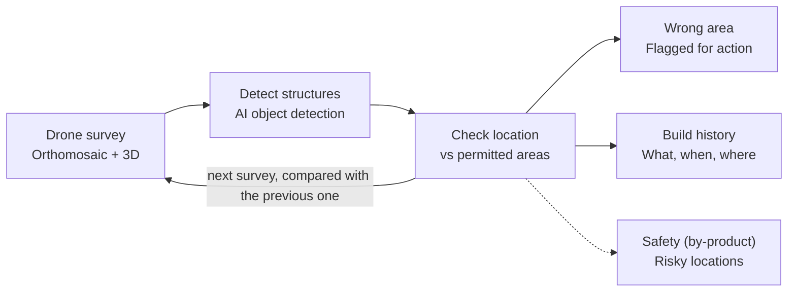
```mermaid
flowchart LR
  A["Drone survey<br/>Orthomosaic + 3D"] --> B["Detect structures<br/>AI object detection"]
  B --> C["Check location<br/>vs permitted areas"]
  C --> D["Wrong area<br/>Flagged for action"]
  C --> E["Build history<br/>What, when, where"]
  C -.-> F["Safety (by-product)<br/>Risky locations"]
  C -->|next survey, compared with the previous one| A
```

**1. Capture.** Drones with high-resolution cameras and LiDAR sensors flew systematic patterns over the site at regular intervals. Separate video flights used the drone's follow-me mode to film key areas while tracking a team member on the ground. LiDAR adds accurate elevation data, which matters for measuring heights, volumes, and terrain changes.

**2. Process.** The imagery and point clouds were processed into orthomosaic maps, 3D models, and digital elevation models (DEMs). Together they give a measurable, up-to-date picture of the whole site.

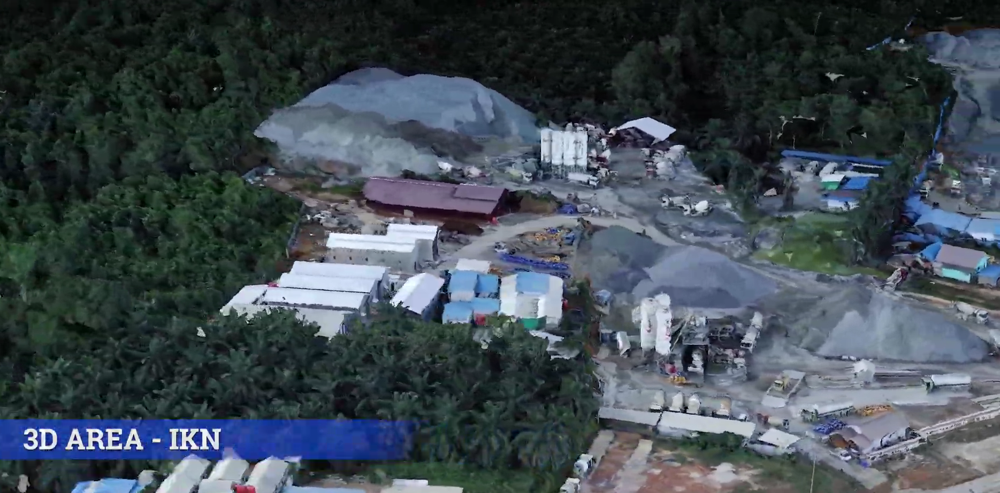

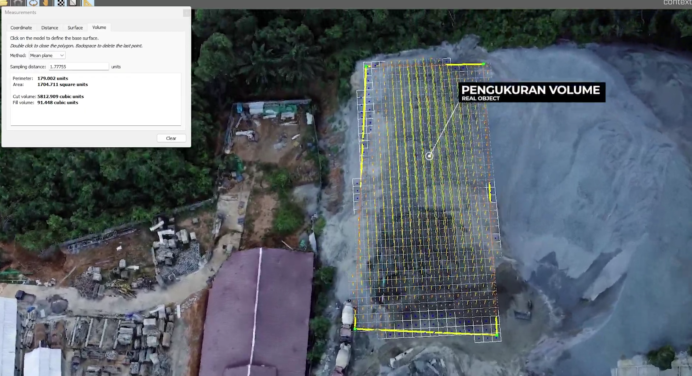

**3. Detect structures.** AI object detection identified every building and structure in the new orthomosaic and recorded its footprint and location. Video footage was analysed frame by frame in the same way. The team then checked results manually to catch structures the model missed.

**4. Check location.** Each detected structure was overlaid on the map of areas where building was permitted. Structures standing outside those areas were flagged for follow-up.

 shown alongside the drone footage.")

**5. Compare over time.** Each survey was compared with the earlier ones to find new and changed structures and when they first appeared. Over repeated flights, this built a history of what was built, when, and where.

**A by-product: safety.** Because every structure had a known location, the same check also showed structures standing in areas unsuitable or risky for building. Safety insight came from data already collected, with no separate analysis. [TO CONFIRM: which risk zones were used]

**6. Report.** Flagged structures and the build history were delivered through a monitoring dashboard, video reports, and written reports for the authority's planning and supervision teams.

### What we delivered

After each survey cycle, the authority received a consistent package:

| Output | What it shows | Who uses it |
| --- | --- | --- |
| Flagged structures | Buildings and structures outside permitted areas, with location and the date first detected | Planning and supervision teams |
| Build history | What was built, when, and where, across all survey dates | Programme managers |
| Monitoring dashboard | Maps, flagged structures, build history, and video in one view | All stakeholders |
| Video reports | Drone footage of key areas, analysed frame by frame for violations | Decision-makers and supervision teams |
| Structure maps | Every detected building and structure on the site | Planners |
| Safety findings (by-product) | Structures in locations unsuitable or risky for building | Site safety teams |
| Orthomosaics, 3D models, DEMs | Measurable base maps for each survey date | Engineers and GIS teams |

### Benefits

- **Nothing built in the wrong place goes unnoticed.** Every structure across the whole site is checked against permitted areas on every survey.
- **Evidence with dates.** Repeated surveys show when a structure first appeared, which supports follow-up action.
- **A complete build history.** What was built, when, and where, from one consistent method.
- **Practical at scale.** AI detection made it possible to check every structure on every survey, which manual review couldn't. [TO CONFIRM: typical turnaround from flight to report]
- **Safety insight at no extra cost.** The location data already collected also revealed structures in risky areas.

### Lessons learned

**Video made findings easier to act on.** A written report alone is hard for stakeholders to engage with. We added video: the drone flew in follow-me mode, tracking a team member moving through the site, and the footage was analysed frame by frame for violations. Showing a flagged structure in its surroundings made the reporting far more interactive than text, and a dashboard brought maps, findings, and video together.

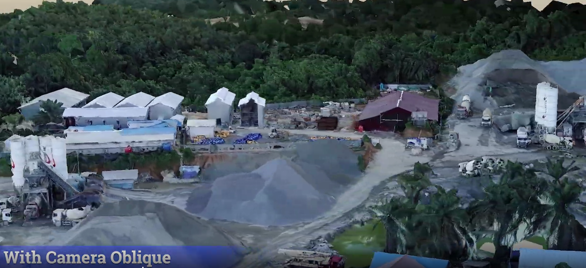

**AI didn't catch everything.** Small or temporary structures, such as workers' sheds (*bedeng*), were not reliably recognised by the detection model. We added manual checks of the AI results so these weren't missed. Automated detection does most of the work, but human review is still part of the process.

**What we'd change in Phase 2.**

1. **Improve small-structure detection with a feedback loop.** Fine-tune the model on labelled local examples (bedeng, tarps, containers, site offices). Use change detection and surface height (LiDAR or DSM) as a second signal, so anything new between surveys is flagged whatever it looks like. Send low-confidence detections to human review and feed the corrections back into training.
2. **Measure detection accuracy.** Track how often the model misses or misidentifies each structure type, so accuracy can be reported as numbers.
3. **Make video repeatable and geo-referenced.** Replace follow-me flights with pre-programmed waypoint routes, so each cycle's footage covers the same path and is directly comparable. Sync the drone's flight log with the video so every violation found in a frame gets a map coordinate and links to the dashboard. De-duplicate detections across frames so one structure counts as one finding.
4. **Turn the dashboard into a case-tracking tool.** Give each flagged structure a status (flagged, verified on the ground, action taken, resolved), add a time slider for the build history, and generate evidence packs with before/after images, dates, and coordinates.
5. **Use satellite data to target drone flights.** Satellite change detection between drone cycles could direct flights to areas where something changed. Frequent cloud cover in Kalimantan may make radar (SAR) more reliable than optical imagery, though its ability to detect structures as small as bedeng needs testing first.
6. **Measure the process.** Record turnaround from flight to report, area covered per cycle, and findings confirmed on the ground.

### To confirm before publishing

- [ ] Year(s) of Phase 1
- [ ] Area covered (hectares or km²)
- [ ] Number of survey flights and the interval between them
- [ ] Drone and sensor types used
- [ ] Source of the permitted-area map (for example the spatial plan) and how it was supplied
- [ ] Which risk zones were used for the safety by-product (for example steep slopes or flood-prone areas)
- [ ] Number of structures detected and flagged, if shareable
- [ ] Typical turnaround from flight to report
- [ ] Team size and your exact role
- [ ] Whether the authority allows the project to be described publicly, even without its name
- [ ] Any images you're allowed to publish (generic site photos, non-sensitive map extracts)

### Site metadata

```yaml
title: "Drone and AI Monitoring of a National Capital Construction Site"
lang: en
translationKey: national-capital-drone-monitoring
sector: infrastructure-construction
secondarySectors: [urban-property]
client: "A national government authority"
location: "East Kalimantan, Indonesia"
year: null            # TO CONFIRM
role: "Programme lead"
methods: [drone-photogrammetry, lidar, object-detection, spatial-overlay, change-detection]
outcome: "Structures built outside permitted areas flagged, with a dated build history"
summary: "Repeated drone surveys and AI detection checked every structure on a new capital city site against where building was permitted."
featured: true
comments: true
map: false
draft: true
cover: 3d_object_3.png
regions:
  - { name: "East Kalimantan", lon: 116.7, lat: -0.97 }
```

---

## 2. Multi-Source Monitoring of a 142 km High-Speed Railway Construction

We monitored construction along the 142 km Jakarta–Bandung high-speed railway corridor, using drone surveys and computer vision to detect and count construction objects against the schedule. Satellite imagery filled the gaps wherever drones couldn't fly. As a third priority, we analysed social media and on-site data to help plan responses to community concerns.

### At a glance

| | |
| --- | --- |
| **Sector** | Infrastructure & Construction |
| **Location** | Jakarta to Bandung corridor, through Bekasi, Karawang, and Purwakarta, Indonesia |
| **Client** | A railway construction consortium |
| **Scope** | Construction progress monitoring along about 142 km, plus social media analysis |
| **Year** | [TO CONFIRM] |
| **My role** | Led the monitoring programme, coordinating drone, engineering, and AI teams |
| **Team** | 10 people: 3 UAV operators, 4 engineers, 2 AI engineers, 1 administrator |
| **Data** | Drone imagery and video, satellite imagery, on-site observations, social media data |
| **Methods** | Drone photogrammetry, computer vision object detection and counting, satellite imagery as gap-fill, time-series 3D modelling of selected sections, social media analysis |
| **Deliverables** | Object counts against schedule, progress reports, time-series 3D models, social response strategy, interactive dashboards |

### The challenge

A 142 km railway corridor is a long, thin construction site that crosses dense cities, industrial zones, farmland, and hills. Work happens at many points at once, so no single inspection gives the full picture. The consortium needed regular answers to three questions:

1. **Is construction keeping pace with the schedule?** How many pile caps, bored piles, girders, and other elements are in place, and where is work behind?
2. **Can monitoring continue when drones can't fly?** Weather, permits, or unexpected restrictions can ground flights over parts of the corridor, leaving gaps in the record.
3. **How is the project perceived, and how should the consortium respond?** Infrastructure on this scale affects nearby communities, and public concerns surface quickly on social media.

### How we did it

The core of the work was a spatial stream tracking the physical build. A smaller, third-priority stream analysed social media and on-site data to guide responses to the public. Both fed the same dashboards.

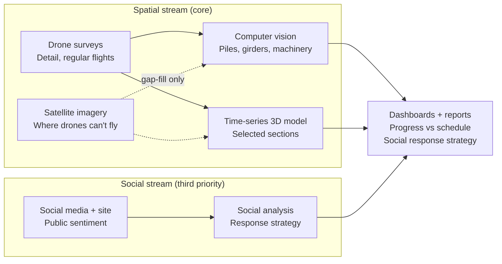
```mermaid
flowchart LR
  subgraph SP["Spatial stream (core)"]
    D["Drone surveys<br/>Detail, regular flights"]
    SAT["Satellite imagery<br/>Where drones can't fly"]
    CV["Computer vision<br/>Piles, girders, machinery"]
    M3["Time-series 3D model<br/>Selected sections"]
  end
  subgraph SO["Social stream (third priority)"]
    SM["Social media + site<br/>Public sentiment"]
    SA["Social analysis<br/>Response strategy"]
  end
  D --> CV
  D --> M3
  SAT -.->|gap-fill only| CV
  SAT -.-> M3
  SM --> SA
  CV --> DB["Dashboards + reports<br/>Progress vs schedule<br/>Social response strategy"]
  M3 --> DB
  SA --> DB
```

**Drones for detail.** Regular drone flights captured high-resolution imagery and video of active sections, to inspect progress and quality and to spot deviations from design.

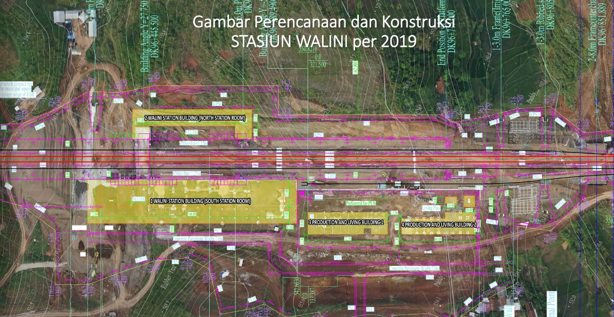

**Satellite imagery to fill the gaps.** Drones couldn't always fly: weather, permits, or unexpected events sometimes made flights over part of the corridor impossible or prohibited. In those periods, satellite imagery covered the missing areas so the monitoring record had no gaps.

**Computer vision for counting.** AI object detection processed the imagery to identify and count construction elements such as pile caps, bored piles, and girders, and to map laydown areas and heavy machinery. Counts were compared with the planned timeline to show which sections were on schedule and which were behind.

**Time-series 3D models of selected sections.** For selected sections, spatial data from each monitoring period was combined into a 3D model, so progress could be compared period by period.

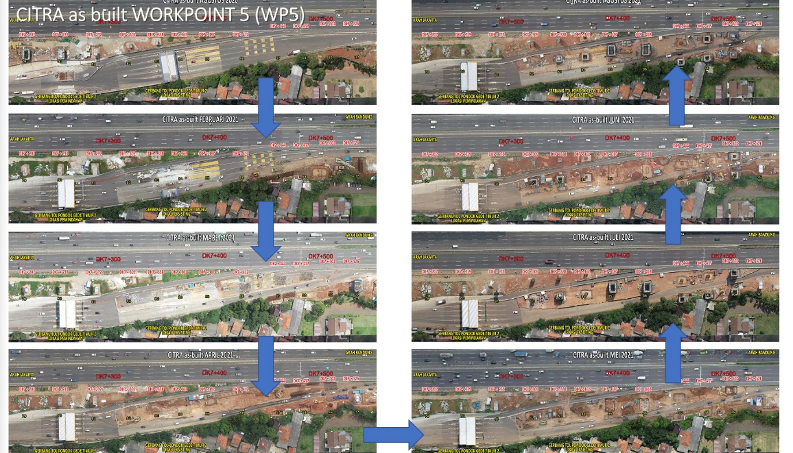

**Social media analysis for response planning.** We analysed social media data to understand public sentiment and concerns about the project. Combining it with what we gathered on site, we helped the consortium decide how to respond. [TO CONFIRM: platforms and analysis methods used]

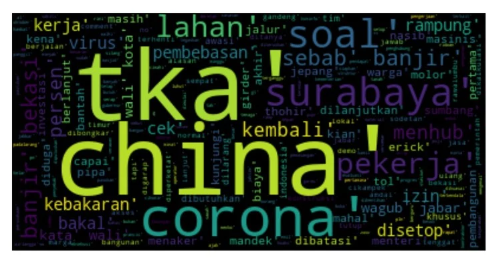

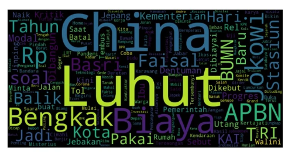

**Reporting.** Results were delivered as reports, interactive dashboards, and the 3D models.

### What we delivered

| Output | What it shows | Who uses it |
| --- | --- | --- |
| Object counts against schedule | Installed pile caps, bored piles, girders, and other elements compared with the planned timeline | Project managers |
| Site activity maps | Laydown areas and heavy machinery locations | Site managers |
| Progress reports | Status by corridor section, delays, and deviations from design | Project managers and engineers |
| Time-series 3D models | How selected sections changed between monitoring periods | Engineers and stakeholders |
| Gap-fill satellite maps | Areas drones couldn't cover in a given period | Project managers |
| Social response strategy | Public sentiment from social media, combined with on-site findings, with recommended responses | Community relations and management |
| Interactive dashboards | Progress, counts, 3D models, and social insights in one place | All stakeholders |

### Benefits

- **Progress measured, not estimated.** Automated counts of pile caps, bored piles, girders, and machinery gave a factual check against the schedule.
- **No gaps when drones were grounded.** Satellite imagery covered areas where weather, permits, or unexpected restrictions stopped flights, so every period had data.
- **Change over time made visible.** Time-series 3D models of selected sections showed how they developed, which helped spot bottlenecks and communicate status.
- **Responding to the public, not just watching.** Social media analysis, combined with on-site data, turned community concerns into concrete response plans. [TO CONFIRM: an example, if shareable]
- **One source for everyone.** Engineers, managers, and community teams worked from the same dashboards.

### Lessons learned

[TO WRITE] Some prompts:

- What made a long, thin corridor harder to monitor than a single site like IKN (flight permissions near cities, airspace, access, logistics)?
- How well did object counting work on pile caps, bored piles, girders, and machinery? Which objects were hard to recognise?
- How were satellite and drone data reconciled when they disagreed?
- What was hardest about the social media work: data access, data quality, or getting teams to act on it?
- What would you do differently next time?

### To confirm before publishing

- [ ] Year(s) of the engagement
- [ ] Monitoring frequency and number of monitoring cycles
- [ ] Which sections had 3D models (or how many)
- [ ] Social media platforms and analysis methods used
- [ ] An example of a response strategy, if shareable
- [ ] Whether the project can be described publicly without the client's name
- [ ] Any images you're allowed to publish

### Site metadata

```yaml
title: "Multi-Source Monitoring of a 142 km High-Speed Railway Construction"
lang: en
translationKey: high-speed-railway-monitoring
sector: infrastructure-construction
secondarySectors: []
client: "A railway construction consortium"
location: "Jakarta–Bandung corridor, Indonesia"
year: null            # TO CONFIRM
role: "Programme lead"
team: 10
methods: [drone-photogrammetry, object-detection, satellite-imagery, time-series-3d, social-media-analysis]
outcome: "Construction progress counted against schedule along 142 km, with no gaps when drones were grounded"
summary: "Drones and computer vision counted construction progress along a 142 km railway, with satellite imagery filling gaps and social media analysis guiding public response."
featured: true
comments: true
map: false
draft: true
cover: citra_asbuilt_wp5.png
regions:
  - { name: "Jakarta–Bandung", lon: 107.25, lat: -6.55 }
```

---

## 3. Nationwide Rice Productivity Assessment in One Month

We predicted rice paddy productivity within a one-month deadline by combining satellite and drone data. Satellite NDVI imagery covered the large area, and drone imagery of sample fields measured how far the satellite readings were off. That error was used to correct the satellite data before productivity was predicted.

### At a glance

| | |
| --- | --- |
| **Sector** | Agriculture & Food Security |
| **Location** | [CONFIRM: rice-producing areas of Java, or nationwide with ground truth in Java] |
| **Client** | A national government ministry |
| **Scope** | Rice paddy productivity prediction |
| **Timeline** | One month |
| **Year** | 2018 (May) |
| **My role** | Project director and data scientist |
| **Team** | 5 UAV teams (3 to 5 people each), 3 GIS engineers, 2 agricultural engineers, 2 data scientists |
| **Data** | Satellite imagery for area coverage; drone (UAV) imagery of sample fields |
| **Methods** | NDVI vegetation index, satellite correction using drone data (mean error), productivity prediction from corrected NDVI |
| **Deliverables** | Productivity maps, yield estimates, regional comparisons |
| **Built on** | An earlier regional pilot using drone near-infrared (NIR) surveys of rice fields |

### The challenge

The government needed an up-to-date picture of rice productivity to guide food security decisions, and it needed it within a month. Two constraints pulled against each other:

1. **Scale.** The area was far too large to survey from the ground or by drone alone. Only satellite imagery could cover it.
2. **Accuracy.** Satellite imagery is coarser and less accurate than close-range data, so its readings needed checking against something more precise.

The method had to combine the reach of satellites with the accuracy of drones.

### How we did it

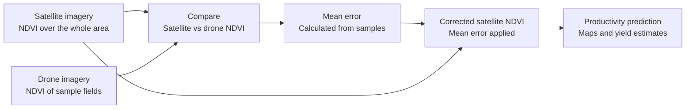
```mermaid
flowchart LR
  S["Satellite imagery<br/>NDVI over the whole area"] --> E["Compare<br/>Satellite vs drone NDVI"]
  D["Drone imagery<br/>NDVI of sample fields"] --> E
  E --> M["Mean error<br/>Calculated from samples"]
  M --> C["Corrected satellite NDVI<br/>Mean error applied"]
  S --> C
  C --> P["Productivity prediction<br/>Maps and yield estimates"]
```

**1. Use NDVI to read crop condition.** The Normalised Difference Vegetation Index (NDVI) of rice plants was used as the basis for predicting productivity.

**2. Cover the area with satellite imagery.** Given the size of the area, satellite imagery was used for data acquisition.

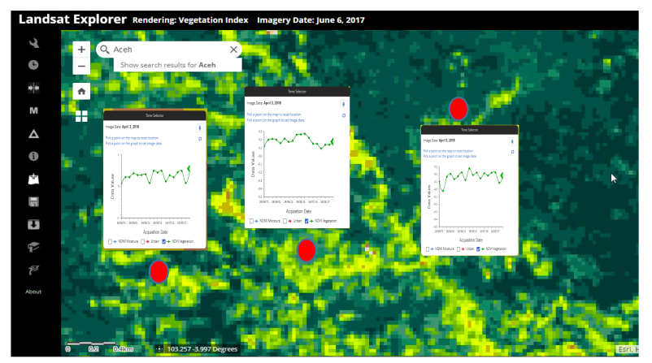

**3. Measure the satellite's error with drones.** Drone imagery of sample fields, flown by five UAV teams in parallel to fit the deadline, was compared with the satellite imagery of the same fields to find the error in the satellite readings.

 and the vegetation index from the same flight (right).")

**4. Correct the satellite data.** The mean error was applied to the satellite imagery, giving corrected values across the whole area.

**5. Predict productivity.** Productivity was predicted from the corrected NDVI values. [CONFIRM: how NDVI was converted to productivity, for example a regression against yield data]

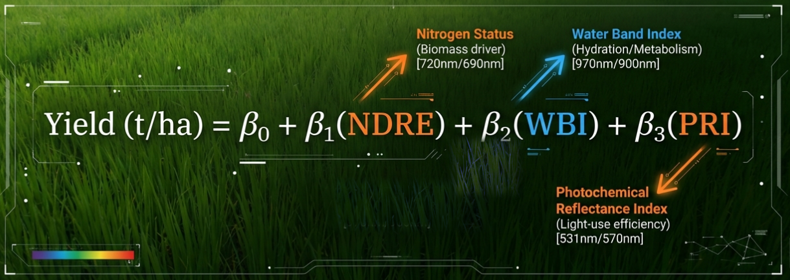

### What we delivered

| Output | What it shows | Who uses it |
| --- | --- | --- |
| Productivity maps | Predicted rice productivity across the study area | Policymakers and agricultural planners |
| Yield estimates | Estimated rice yields by area [TO CONFIRM: district, province, or other level] | Food security planners |
| Regional comparisons | Where productivity is high and low | Policymakers |
| Corrected NDVI dataset | Satellite NDVI corrected with drone measurements | Analysts, for validation and future assessments |
| Report | Findings and recommendations | Ministry decision-makers |

### Benefits

- **A large-area picture in one month.** Combining drones and satellites made the assessment possible on a timeline field surveys could never meet.
- **Satellite data checked against close-range data.** Drone measurements corrected the satellite readings, so the estimates weren't based on satellite data alone.
- **Clear contrasts between areas.** The maps showed where productivity was strong and where it lagged, so interventions could be targeted.
- **A method to build on.** The drone-and-satellite approach, first tested in a regional pilot, scaled up and showed clearly what to improve next time.

### Lessons learned

**One drone flight gave us no time reference.** The drone data was acquired only once. Rice changes quickly through its growth stages, so a single detailed snapshot couldn't show how the crop developed over time, and the correction was based on one moment in the season.

**Satellite data alone picked the wrong survey sites.** We used satellite data to estimate the age of the rice and choose where to send field survey teams. The satellite estimates weren't accurate enough, so some of the first areas chosen weren't at the expected growth stage.

**NDVI needs a variety database to become productivity.** Different rice varieties grow differently, so the same NDVI value doesn't mean the same yield for every variety. A database of variety characteristics is needed to build reliable curves relating NDVI to productivity.

**What we'd do next time.**

1. **Fly drones several times through the season,** so the detailed data has a time reference across growth stages.
2. **Check rice age on the ground or with higher-resolution data** before choosing field survey sites, instead of relying on satellite data alone.
3. **Build a database of rice variety characteristics,** and use it to create NDVI–productivity curves for each variety.

### To confirm before publishing

- [ ] **Scope:** the lesson-learned record says "several areas of Java," while the portfolio describes a nationwide assessment. Which is correct?
- [ ] How NDVI was converted to productivity
- [ ] Satellite source (for example Sentinel-2, Landsat, or commercial imagery)
- [ ] Output level: field, district, province?
- [ ] Whether the project can be described publicly without the ministry's name
- [ ] Any images you're allowed to publish

### Site metadata

```yaml
title: "Nationwide Rice Productivity Assessment in One Month"
lang: en
translationKey: national-rice-productivity
sector: agriculture-food-security
secondarySectors: []
client: "A national government ministry"
location: "Indonesia"   # CONFIRM: Java or nationwide
year: 2018
role: "Project director and data scientist"
team: "22-32"         # 5 UAV teams of 3-5, plus 7 engineers and data scientists
methods: [ndvi, satellite-imagery, drone-calibration, mean-error-correction, yield-prediction]
outcome: "Rice productivity predicted from drone-corrected satellite NDVI within one month"
summary: "Satellite NDVI, corrected with drone imagery of sample fields, predicted rice productivity within a one-month deadline."
featured: true
comments: true
map: false
draft: true
cover: ortho_vs_hyperspectral.png
regions:
  - { name: "Java", lon: 110.4, lat: -7.3 }
```

---

## 4. Hydropower Feasibility Studies Across Four Remote Sites

Under a 12-month blanket contract, we carried out feasibility studies for hydropower plants at four remote sites in Kalimantan, Sumatra, and Sulawesi. Targeted drone LiDAR, drone imagery, field sensors, and official statistics were combined to decide where each plant's key components should go and to forecast flood and erosion risk. All four sites went on to construction.

### At a glance

| | |
| --- | --- |
| **Sector** | Energy |
| **Location** | Four sites in Kapuas Hulu (West Kalimantan), Lampung, and Poso (Central Sulawesi), Indonesia |
| **Client** | A hydropower developer |
| **Scope** | Feasibility studies for four hydropower sites under one blanket contract |
| **Timeline** | 12 months |
| **Outcome** | All four sites proceeded to construction |
| **Year** | [TO CONFIRM] |
| **My role** | Managed the contract and all four studies, overseeing the LiDAR, drone, sensor, statistics, and machine learning workstreams |
| **Data** | Drone LiDAR, drone imagery and video, IoT water-flow and weather sensors, BPS (Statistics Indonesia) data |
| **Methods** | LiDAR processing into terrain models, drone mapping, sensor data analysis, machine learning to forecast flood and erosion areas |
| **Deliverables** | Feasibility reports, topographic maps, 3D models, and DEMs for each site, plus recommended component locations |
| **Built on** | An earlier LiDAR methodology study for a minihydro project in South Sulawesi |

### The challenge

A hydropower plant's output and cost depend heavily on where its parts go: the intake, the water channel, the turbine, and the powerhouse. Getting those locations right needs accurate terrain and water data, and the developer needed that for four very different sites in one year:

1. **Remote, difficult terrain.** Dense forest, hills, and rivers make ground surveys slow, and the forest canopy hides the ground from ordinary aerial photos.
2. **Four sites, one standard.** Each site has its own rivers, terrain, and communities, but the developer needed results it could compare across sites to decide which to pursue.
3. **Risks found early.** Flooding, erosion, and social factors can make a site uneconomic. These had to surface during the feasibility study, not during construction.

### How we did it

Every site followed the same method, adapted from an earlier LiDAR study for a minihydro project in South Sulawesi.

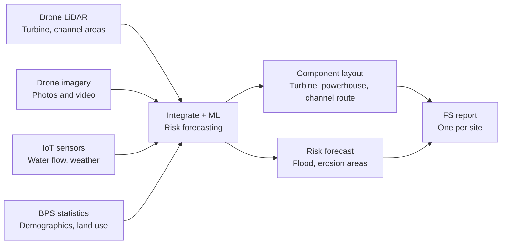
```mermaid
flowchart LR
  L["Drone LiDAR<br/>Turbine, channel areas"] --> I["Integrate + ML<br/>Risk forecasting"]
  D["Drone imagery<br/>Photos and video"] --> I
  T["IoT sensors<br/>Water flow, weather"] --> I
  B["BPS statistics<br/>Demographics, land use"] --> I
  I --> C["Component layout<br/>Turbine, powerhouse, channel route"]
  I --> R["Risk forecast<br/>Flood, erosion areas"]
  C --> F["FS report<br/>One per site"]
  R --> F
```

**1. Target the LiDAR survey.** Drawing on the earlier study, operators flew drone-mounted LiDAR over the areas that decide a hydropower layout: potential turbine spots, powerhouse locations, and channel routes. LiDAR captures detailed elevation data, including the ground beneath vegetation.

**2. Build terrain models.** The LiDAR data was processed into topographic maps, 3D models, and digital elevation models (DEMs) for each site.

**3. Add drone imagery.** High-resolution drone photos and video gave visual context for each site.

**4. Measure water and weather.** IoT devices such as water-flow sensors and weather stations recorded water levels, flow rates, and weather patterns.

**5. Add social and land-use context.** BPS (Statistics Indonesia) data added local demographics, land use, and environmental conditions.

**6. Integrate and forecast risk.** Machine learning combined the terrain, water, weather, and statistics data to forecast areas likely to flood or erode.

**7. Decide the layout.** Turbine locations were chosen on water flow and terrain slope, channel routes to minimise energy loss, and powerhouse positions to suit the terrain and access. Each site's results went into its own feasibility report.

### What we delivered

For each of the four sites:

| Output | What it shows | Who uses it |
| --- | --- | --- |
| Feasibility report | Site suitability, recommended layout, risks, and mitigation | Developer's decision-makers |
| Recommended component locations | Where the turbine, powerhouse, and water channel should go, and why | Design engineers |
| Topographic maps and DEMs | Bare-earth terrain from LiDAR, including under forest cover | Engineers |
| 3D models | The site in three dimensions, for layout planning and communication | Engineers and stakeholders |
| Risk maps | Forecast flood- and erosion-prone areas | Engineers and planners |
| Interactive maps | All layers for the site in one browsable view | All stakeholders |

### Benefits

- **Four out of four sites built.** Every site studied went on to construction, so the feasibility work directly supported real investment decisions.
- **Layouts based on real terrain.** LiDAR sees through forest canopy to the ground, so component locations were chosen on accurate elevation data rather than estimates.
- **Efficient surveys.** Focusing drone LiDAR on the areas that decide the layout kept data collection fast and affordable at remote sites.
- **Comparable results across sites.** One method across four sites let the developer compare them side by side.
- **Risks forecast early.** Machine learning forecast flood- and erosion-prone areas while design changes were still cheap.
- **A proven, repeatable method.** The approach developed for an earlier minihydro study carried over to four new sites, and can carry over again.

### Lessons learned

[DRAFT: generated from the portfolio; edit anything that doesn't match your experience]

**Targeting beats blanket coverage.** The earlier minihydro study taught us where layout decisions are actually made: around potential turbine spots, powerhouse locations, and channel routes. Concentrating LiDAR on those areas, instead of scanning everything at the same density, saved time and cost at sites that are expensive to reach.

**A few months of sensor data is not a hydrological record.** Water-flow sensors and weather stations gave valuable current measurements, but a deployment within a 12-month contract can't capture year-to-year variation in river flow. Sensor data is most useful alongside longer-term records.

**Remote sites make logistics the hidden schedule.** Four sites on three islands meant mobilising teams and equipment, finding power and connectivity, and timing fieldwork around weather. Planning those campaigns carefully mattered as much as the analysis.

**Statistics add the human side.** BPS data on population and land use highlighted social factors that terrain data alone can't show, such as settlements and land use near the planned infrastructure.

**What we'd do differently.**

1. **Standardise the site data package from day one,** so every site's outputs follow the same structure and comparisons are effortless.
2. **Deploy sensors as early and as long as possible,** and combine them with any long-term flow records available for each river.
3. **Check machine learning risk outputs with local knowledge,** such as residents' accounts of past floods, before relying on them.

### To confirm before publishing

- [ ] Which IoT sensors were deployed, and for how long
- [ ] Review the [DRAFT] lessons learned
- [ ] Year, team size, and your exact role
- [ ] Whether the project can be described publicly without the developer's name
- [ ] Any images you're allowed to publish

### Site metadata

```yaml
title: "Hydropower Feasibility Studies Across Four Remote Sites"
lang: en
translationKey: hydropower-four-site-feasibility
sector: energy
secondarySectors: []
client: "A hydropower developer"
location: "Kapuas Hulu, Lampung, and Poso, Indonesia"
year: null            # TO CONFIRM
role: "Contract and programme manager"
methods: [drone-lidar, drone-mapping, iot-sensors, official-statistics, flood-erosion-forecasting]
outcome: "Feasibility studies for four hydropower sites in 12 months; all four proceeded to construction"
summary: "Drone LiDAR, field sensors, and machine learning informed feasibility studies at four remote hydropower sites, all of which went on to construction."
featured: true
comments: true
map: false
draft: true
regions:
  - { name: "Kapuas Hulu", lon: 112.8, lat: 0.8 }
  - { name: "Lampung", lon: 105.0, lat: -5.0 }
  - { name: "Poso", lon: 120.75, lat: -1.4 }
coverIllustration: true
```

---

## 5. Landslide Early Warning System for Minihydro Power Plants

We built a landslide early warning system for an operator of multiple minihydro power plants. Drone surveys set a detailed baseline once or twice a year; between baselines, satellite data, IoT sensors, and the plants' own SCADA data feed a Random Forest model. Every day it reports which areas are most likely to be hit by a landslide, how far a slide could reach, and which assets are at risk, so field operators can check and act. The system was designed together with the client's engineers and operators, and after launch we trained their staff and continued to maintain and improve it.

### At a glance

| | |
| --- | --- |
| **Sector** | Energy (secondary: Environment & Pollution) |
| **Location** | [TO CONFIRM: regions or number of plants covered] |
| **Client** | An operator of multiple minihydro power plants |
| **Scope** | Design, build, deployment, training, and ongoing maintenance of a landslide early warning system |
| **Year** | [TO CONFIRM] |
| **My role** | [TO CONFIRM] |
| **Team** | Our team: 2 spatial data scientists, 1 programmer, 1 GIS engineer. Client side: about 20 engineers and field operators contributing knowledge and feedback |
| **Data** | Periodic drone baselines; InSAR ground movement, hyperspectral imagery, orthophotos, weather forecasts, wind data, and geological fault lines; rain gauges; SCADA water level and flow |
| **Methods** | Drone baselines once or twice a year, satellite monitoring between baselines, deep learning land cover classification, Random Forest landslide forecasting, web-based early warning dashboard |
| **Stack** | QGIS, Python (spatial processing, machine learning, deep learning, Django), Node, Leaflet, PostgreSQL with PostGIS |
| **Deliverables** | Daily landslide risk reports, early warning dashboard, operator training, ongoing maintenance and improvement |

### The challenge

Minihydro plants sit in steep river valleys, exactly where landslides happen. A landslide can block an intake, break a water channel, damage a powerhouse, or cut the only access road, stopping generation and putting staff at risk. For an operator running many plants, the questions were:

1. **Where and when is a landslide likely?** Knowing which slopes are dangerous isn't enough; operators need warning when conditions turn risky.
2. **Can existing data help?** The plants already produce operational data through SCADA, but it was never used for hazard monitoring.
3. **Will people actually use it?** A warning system only works if operators trust it and know how to act on it, at every plant, long after the project ends.

### How we did it

Detailed drone baselines are expensive to repeat at remote plants, so the system uses them sparingly and lets satellite data carry the monitoring in between. All data goes into one spatial database, a Random Forest model turns it into a daily risk report, and field operators confirm and act on it. Their feedback flows back to improve the model.

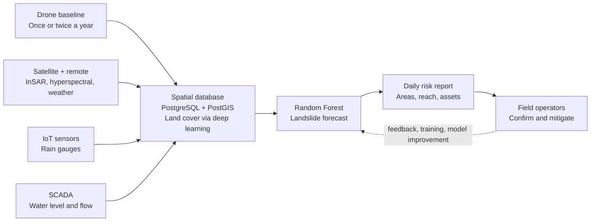
```mermaid
flowchart LR
  D["Drone baseline<br/>Once or twice a year"] --> DB["Spatial database<br/>PostgreSQL + PostGIS<br/>Land cover via deep learning"]
  S["Satellite + remote<br/>InSAR, hyperspectral, weather"] --> DB
  I["IoT sensors<br/>Rain gauges"] --> DB
  SC["SCADA<br/>Water level and flow"] --> DB
  DB --> RF["Random Forest<br/>Landslide forecast"]
  RF --> R["Daily risk report<br/>Areas, reach, assets"]
  R --> O["Field operators<br/>Confirm and mitigate"]
  O -.->|feedback, training, model improvement| RF
```

**1. Start with the people who know the sites.** We worked with the client's engineers and operators, alongside other specialists, to understand past landslides, the most exposed assets, and what a useful warning looks like in practice.

**2. Set a drone baseline, then monitor remotely.** Once or twice a year, drone surveys capture a detailed baseline of the terrain around each plant. Between baselines, remote data carries the monitoring: InSAR for ground movement, hyperspectral imagery, orthophotos, weather forecasts, wind data, and geological fault lines. Rain gauges in the field add local rainfall, and the plants' SCADA systems add water level and flow. This means the team doesn't have to visit every site often.

**3. Bring it into one spatial database.** All data was ingested into PostgreSQL with PostGIS, and processed with QGIS and Python so every reading is tied to a location and a time. A deep learning image classifier maps land cover from the imagery, which becomes one of the forecast model's inputs.

**4. Forecast with machine learning.** A Random Forest model trained on the combined data forecasts which areas are most likely to be hit by a landslide, how far a slide could reach, and which plant assets fall within that reach.

**5. Deliver a daily report.** A Django backend serves the forecast to a web dashboard built with Node and Leaflet, producing a daily report of high-risk areas, likely impact extent, and assets at risk. Operators see it on the dashboard and also receive it as a dedicated daily report.

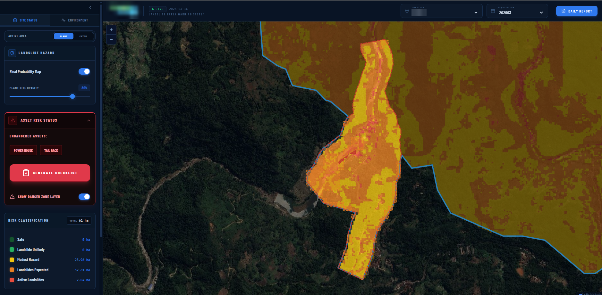

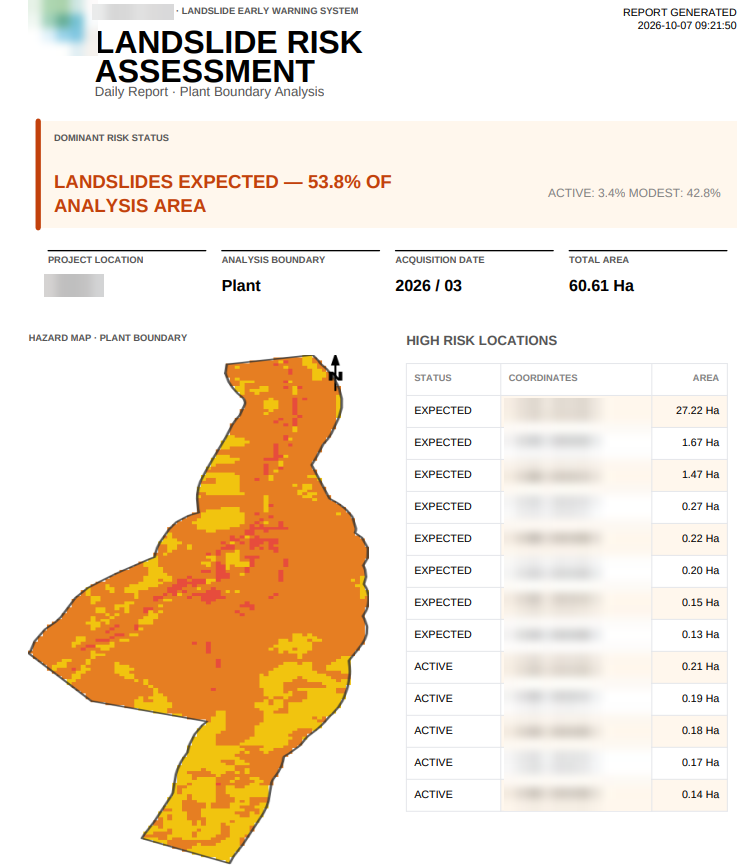

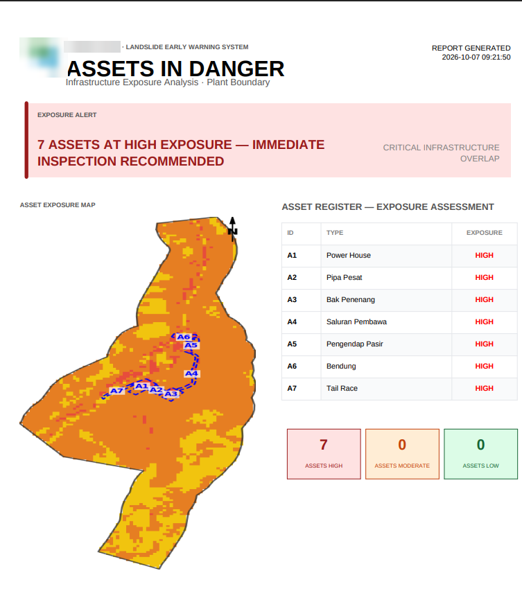

**6. Confirm and mitigate in the field.** Field operators use the daily report to decide which areas to monitor. They confirm conditions on the ground and carry out mitigation where needed, such as covering slopes with geotextile or replanting vegetation.

**7. Train, maintain, and improve.** After launch we trained the client's staff and continued to maintain the system, improving the model as new data and operator feedback came in.

### Technology stack

The whole system runs on open-source tools, so the client isn't tied to software licences.

| Layer | Tools | Role |
| --- | --- | --- |
| Spatial processing | QGIS, Python spatial libraries | Preparing and analysing drone, satellite, and terrain data |
| Deep learning | Python [TO CONFIRM: library] | Classifying land cover from imagery |
| Machine learning | Python, Random Forest [TO CONFIRM: library, for example scikit-learn] | Forecasting landslide areas, reach, and assets at risk |
| Database | PostgreSQL with PostGIS | Storing spatial, sensor, and SCADA data in one place |
| Backend | Python, Django | Data ingestion, model results, and the web API |
| Frontend | Node, Leaflet | The web map, dashboard, and daily report |

### What we delivered

| Output | What it does | Who uses it |
| --- | --- | --- |
| Daily landslide risk report | Lists the areas most likely to be hit, how far a slide could reach, and which assets are at risk | Field operators and plant managers |
| Web map and dashboard | Shows plants, risk areas, impact extent, sensor readings, and assets on one map | Operators and engineers |
| Field response workflow | Operators check flagged areas on the ground and mitigate, for example with geotextile or replanting | Field operators |
| Integrated database | Drone, satellite, IoT, and SCADA data in one spatial database | The client's technical team |
| Random Forest model | Learns the conditions that lead to landslides from the combined data | Runs inside the system |
| Operator training | How to read the daily report and act on it | Operators and engineers |
| Maintenance and improvement | Ongoing fixes, updates, and model improvements after launch | The client |

### Benefits

- **A daily forecast, not just a hazard map.** Operators know each day where a landslide is most likely, how far it could reach, and what it could hit.
- **Fewer site visits.** Drone baselines once or twice a year, with satellite monitoring in between, keep the system current without frequent trips to remote plants.
- **From warning to action.** The daily report directs field operators to the right slopes, where they confirm conditions and mitigate with measures like geotextile or replanting.
- **Existing data put to new use.** SCADA data the plants already collected became an input for hazard forecasting.
- **Built with the people who use it.** Designing alongside the client's engineers and operators made the system fit how the plants actually run.
- **Still in use after launch.** Training, maintenance, and ongoing improvement kept the system working and trusted.
- **No licence lock-in.** An entirely open-source stack keeps running costs down and lets the client's team extend it.

### Lessons learned

[DRAFT: generated from what you described; edit anything that doesn't match your experience]

**Operators know things sensors don't.** The client's engineers and operators knew which slopes had moved before, which roads close in heavy rain, and what warning signs they watch for. Bringing that knowledge in early shaped the model and made its warnings credible to the people receiving them.

**Operational data wasn't built for hazard analysis.** SCADA records are designed to run a plant, not to study slopes. Making them usable alongside spatial data took real work: aligning timestamps, handling gaps, and linking readings to locations.

**Landslides are rare, which makes learning hard.** A machine learning model needs examples, and each plant sees few landslides. Balancing false alarms against missed warnings had to be tuned with the operators, because too many false alarms and people stop listening. Random Forest also shows which inputs drive each forecast, which helps explain results to operators.

**The project doesn't end at launch.** Training and ongoing maintenance were what turned a delivered system into one that's actually used. Each new event and each piece of operator feedback is a chance to improve the model.

**What we'd do next.**

1. **Measure warning performance,** such as how far ahead warnings come and how often they're false alarms, to show the system's value in numbers.
2. **Keep a structured event log** at every plant, so each landslide or near-miss becomes training data.
3. **Add more ground sensors at the highest-risk slopes,** where earlier signs of movement may show up.

### To confirm before publishing

- [ ] Machine learning and deep learning libraries used
- [ ] Number of plants and regions covered
- [ ] Review the [DRAFT] lessons learned
- [ ] Year and your role
- [ ] Any real warnings issued or events captured, if shareable
- [ ] Whether the project can be described publicly without the client's name
- [ ] Any screenshots of the dashboard you're allowed to publish

### Site metadata

```yaml
title: "Landslide Early Warning System for Minihydro Power Plants"
lang: en
translationKey: landslide-early-warning-minihydro
sector: energy
secondarySectors: [environment-pollution]
client: "An operator of multiple minihydro power plants"
location: "Indonesia"   # TO CONFIRM
year: null            # TO CONFIRM
role: null            # TO CONFIRM
team: 4               # plus about 20 client engineers and field operators
methods: [drone-baseline, insar, hyperspectral, rain-gauges, scada-integration, deep-learning-land-cover, random-forest]
stack: [qgis, python, django, node, leaflet, postgresql, postgis]
outcome: "Daily landslide risk reports showing likely areas, impact extent, and assets at risk, acted on by field operators"
summary: "Drone baselines, InSAR, rain gauges, and SCADA data feed a Random Forest model that gives minihydro operators a daily landslide risk report."
featured: true
comments: true
map: false
draft: true
cover: main.png
```

---

## 6. Mapping Illegal Mining to Protect Communities and Nature

Illegal mining strips forests, erodes hillsides, and contaminates the rivers that nearby communities rely on for water, farming, and food. In three regions of Indonesia, we mapped mining activity to find out how many mines were operating illegally and what harm they were doing to people and nature. Drone surveys located every mining site, comparison with permit areas identified the illegal ones, and soil and water sampling measured the damage. The result showed where communities and ecosystems were most at risk, and where restoration should start.

### At a glance

| | |
| --- | --- |
| **Sector** | Mining (secondary: Environment & Pollution, Forestry & Land Governance) |
| **Location** | Buton (Southeast Sulawesi), Malang (East Java), and Kuningan (West Java), Indonesia |
| **Client** | A national environmental agency |
| **Purpose** | Protecting communities and ecosystems from the effects of illegal mining |
| **Scope** | Mapping mining activity, identifying illegal mines, and assessing the danger to land, water, and people in three regions |
| **Year** | [TO CONFIRM] |
| **My role** | [TO CONFIRM] |
| **Data** | Drone imagery (high-resolution RGB and multispectral), mining permit areas, soil and water samples |
| **Methods** | Drone photogrammetry, land classification, comparison with permit areas, environmental sampling, risk mapping |
| **Deliverables** | Inventory of illegal mines, land classification maps, danger maps, 3D models, restoration and enforcement recommendations |

### The challenge

Illegal mining is hard to regulate because it's hard to see. Sites are often small, scattered, and in remote or hilly terrain, and they appear and move faster than ground inspections can follow. The agency needed answers to two questions in three very different regions:

1. **How many illegal mines are there, and where?** Without an accurate count and location for each site, enforcement and restoration can't be planned.
2. **How dangerous are they?** Mining without controls can strip forest, destabilise slopes, and contaminate rivers that communities depend on. The agency needed to know where the damage was worst and what kind it was.

Each region mined something different (nickel, limestone and marble, and gold) so the dangers differed too. One method had to work across all three.

Behind the numbers are people and places: villages downstream of a contaminated river, farmers whose fields depend on clean water, and forests that hold hillsides together. The aim wasn't to stop mining, which supports local economies, but to bring it under rules that protect the environment and the communities around it.

### How we did it

The method had two tracks: one to find and count illegal mines, and one to measure the damage they cause.

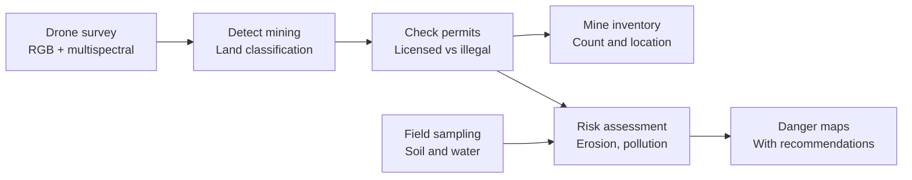
```mermaid
flowchart LR
  D["Drone survey<br/>RGB + multispectral"] --> M["Detect mining<br/>Land classification"]
  M --> P["Check permits<br/>Licensed vs illegal"]
  P --> I["Mine inventory<br/>Count and location"]
  P --> R["Risk assessment<br/>Erosion, pollution"]
  S["Field sampling<br/>Soil and water"] --> R
  R --> DM["Danger maps<br/>With recommendations"]
```

**1. Survey from the air.** Drones with high-resolution and multispectral cameras flew over the mining areas in all three regions, capturing the terrain, vegetation, and water bodies. The imagery was processed into orthomosaic maps and 3D models.

**2. Detect mining sites.** Land classification separated forest, farmland, water, and mining sites, showing every area disturbed by mining. [TO CONFIRM: manual interpretation, AI classification, or both]

**3. Separate legal from illegal.** Each detected mining site was compared with licensed mining permit areas. Sites operating outside any permit were counted as illegal and added to the inventory with their location and size.

**4. Sample soil and water.** Field teams collected soil and water samples around the mining areas to measure contamination and identify its sources.

**5. Assess the danger.** Combining the imagery, terrain, and sample results showed where mining was causing deforestation, erosion, water disruption, or contamination, and how severe each was.

**6. Recommend action.** Each region received danger maps and recommendations: where to enforce, where to improve waste management, and where to restore land and forest.

### Three regions, three kinds of danger

The same method revealed very different problems in each region:

| Region | What was mined | Illegal mines found | Main danger found |
| --- | --- | --- | --- |
| Buton, Southeast Sulawesi | Nickel | [TO CONFIRM: number] | Deforestation and soil erosion around mining sites |
| Malang, East Java | Limestone and marble | [TO CONFIRM: number] | Disruption of local water systems |
| Kuningan, West Java | Gold | [TO CONFIRM: number] | Contamination of nearby rivers, threatening communities and ecosystems |

These dangers compound. Erosion on cleared slopes raises the risk of landslides, and contaminated rivers carry the damage far beyond the mine itself, into farmland and drinking water downstream.

### Who the work protects

| Who or what | How illegal mining threatens it | How the mapping helps |
| --- | --- | --- |
| Downstream communities | Contaminated rivers affect drinking water, fishing, and health | Shows which rivers and villages are at risk, so monitoring and clean-up can be prioritised |
| Farmers | Polluted water and eroded soil damage fields and harvests | Identifies affected farmland and the sources of contamination |
| Forests and habitats | Clearing for mining removes forest and fragments habitat | Measures forest loss and shows where reforestation is most needed |
| Hillsides and soils | Stripped slopes erode and can become unstable | Locates eroding areas for soil restoration and slope protection |
| Water systems | Mining can disrupt how water flows through an area | Maps disruption so water systems can be restored |

### What we delivered

| Output | What it shows | Who uses it |
| --- | --- | --- |
| Illegal mine inventory | Count and location of every illegal mining site in each region | Enforcement and regulatory teams |
| Land classification maps | Forest, farmland, mining sites, and water bodies | Planners and regulators |
| Danger maps | Where erosion, water disruption, and contamination are worst | Environmental managers |
| Soil and water findings | Measured contamination at sampled locations | Environmental and public health teams |
| Orthomosaics and 3D models | Current, measurable views of each mining area | Technical teams |
| Recommendations | Priority areas for enforcement, waste management, reforestation, and land restoration | Agency decision-makers |
| Reports and interactive maps | All findings in one place for each region | All stakeholders |

### Benefits

- **Communities at risk made visible.** The maps showed which rivers, villages, and farmland were exposed to mining damage, so protection could start where people were most affected.
- **A plan for restoring nature.** Measured forest loss and erosion showed where reforestation and soil restoration were most needed.
- **A count, not an estimate.** The agency knew how many illegal mines were operating and exactly where, instead of relying on reports and guesswork.
- **Danger ranked by place.** Combining imagery with soil and water samples showed which sites were doing the most harm, so action could start there.
- **A fair basis for regulation.** Dated, georeferenced evidence supported decisions that balance the economic value of mining with protecting people and nature.
- **One method, three regions.** The same approach worked for nickel, limestone, and gold mining, so results could be compared.

### Lessons learned

[DRAFT: generated from the portfolio; edit anything that doesn't match your experience]

**Imagery finds the mines; sampling proves the harm.** Drone imagery is excellent at showing where mining is happening and how much land it has disturbed. It can't show what's in the water. Pairing aerial mapping with soil and water sampling turned a map of activity into evidence of danger.

**Permit data is only as good as its boundaries.** Separating legal from illegal mining depends on accurate permit maps. Where permit boundaries were outdated or imprecise, the comparison needed care and field checks. [CONFIRM: whether this was a real issue]

**Illegal sites change quickly.** Small mines open, move, and close fast. An inventory is a snapshot, so repeat surveys are needed to keep it useful.

**Fieldwork near illegal mines needs care.** Teams working near active, unlicensed operations face safety and social risks, so access had to be planned with local authorities. [CONFIRM: whether this matched your experience]

**What we'd do next.**

1. **Repeat surveys on a schedule** to track new sites and confirm closures.
2. **Use satellite change detection between drone surveys** to spot new clearings early.
3. **Link danger maps to downstream communities and water users,** so the people at risk are clear.

### To confirm before publishing

- [ ] **The number of illegal mines** found in each region (or a total, if per-region counts are sensitive)
- [ ] **How mining sites were detected:** manual interpretation, AI classification, or both?
- [ ] Which soil and water parameters were measured
- [ ] Whether the dangers listed per region are accurate
- [ ] Any community or conservation outcome you can share, for example restoration that followed or communities consulted
- [ ] Review the [DRAFT] lessons learned
- [ ] Year, team size, and your role
- [ ] Whether the project can be described publicly without the agency's name; since this touches enforcement, keep site locations general
- [ ] Any images you're allowed to publish

### Site metadata

```yaml
title: "Mapping Illegal Mining to Protect Communities and Nature"
lang: en
translationKey: illegal-mining-communities-nature
sector: mining
secondarySectors: [environment-pollution, forestry-land-governance]
tags: [conservation, communities, illegal-mining, water-quality]
client: "A national environmental agency"
location: "Buton, Malang, and Kuningan, Indonesia"
year: null            # TO CONFIRM
role: null            # TO CONFIRM
methods: [drone-photogrammetry, multispectral, land-classification, permit-overlay, soil-water-sampling, risk-mapping]
outcome: "Illegal mines counted and mapped across three regions, showing where communities and ecosystems were most at risk"
summary: "Drone mapping, permit comparison, and soil and water sampling revealed illegal mines in three regions and the harm they posed to communities and nature."
featured: true
comments: true
map: false
draft: true
regions:
  - { name: "Buton", lon: 122.9, lat: -5.3 }
  - { name: "Malang", lon: 112.63, lat: -7.98 }
  - { name: "Kuningan", lon: 108.48, lat: -6.98 }
coverIllustration: true
```

---

## 7. Forecasting Belitung's Coastline: Sea-Level Rise, Mangroves, and Tin Mining

Between 1990 and 2024, Belitung Island lost about 3,800 hectares of land. We measured how its coastline changed over those 34 years using open satellite data, identified what was driving the change, from sea-level rise to mangrove loss and tin mining, and projected where the coast is likely to be by mid-century under three climate scenarios. The result shows which stretches of coast, and the communities and ecosystems along them, face the highest risk.

### At a glance

| | |
| --- | --- |
| **Sector** | Environment & Pollution (secondary: Mining) |
| **Location** | Belitung Island, Bangka Belitung, Indonesia |
| **Client** | [TO CONFIRM: client type, or self-initiated study] |
| **Scope** | Historical coastline change 1990–2024 and a coastline forecast to [TO CONFIRM: 2045 or 2050] |
| **Year** | [TO CONFIRM] |
| **My role** | [TO CONFIRM] |
| **Data** | Landsat 5/7/8/9, Sentinel-2, Sentinel-1 SAR, Copernicus DEM, Global Mangrove Watch, IPCC AR6 sea-level projections |
| **Methods** | Google Earth Engine shoreline extraction (MNDWI), tidal correction, trend analysis across six epochs, Bruun Rule sea-level retreat, driver analysis |
| **Tools** | Google Earth Engine, CoastSat with the FES2014 tide model, QGIS with DSAS |
| **Deliverables** | Land change analysis, projected shoreline and change rasters, coastal risk maps under three scenarios, recommendations |

### The challenge

Belitung's coast is changing under several pressures at once. Sea levels are rising, waves wear away exposed shores, mangroves that once held the coastline together are disappearing, and decades of tin mining have reshaped land and seabed alike. Some stretches lose land; others gain it through sedimentation or reclamation.

Coastal planners needed answers to three questions:

1. **How much has the coast actually changed, and where?** An island-wide total hides the local story; what matters is which stretches are retreating and how fast.
2. **What is driving it?** Climate, mangrove loss, and mining call for very different responses.
3. **Where will the coast be in the coming decades?** Past trends alone can't capture accelerating sea-level rise, so the forecast had to combine history with physics.

The answers matter most to the people living along the coast: villages, fishing communities, and the mangrove and coastal ecosystems they depend on.

### How we did it

The pipeline runs on open satellite data and open tools. The first half measures the past; the second half projects the future.

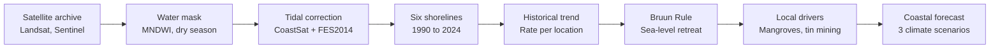
```mermaid
flowchart LR
  A["Satellite archive<br/>Landsat, Sentinel"] --> W["Water mask<br/>MNDWI, dry season"]
  W --> T["Tidal correction<br/>CoastSat + FES2014"]
  T --> S["Six shorelines<br/>1990 to 2024"]
  S --> H["Historical trend<br/>Rate per location"]
  H --> B["Bruun Rule<br/>Sea-level retreat"]
  B --> D["Local drivers<br/>Mangroves, tin mining"]
  D --> F["Coastal forecast<br/>3 climate scenarios"]
```

**1. Build cloud-free composites.** The Landsat archive (Landsat 5, 7, 8, and 9) provides the long record back to 1990. From 2014, Sentinel-2 adds sharper optical imagery and Sentinel-1 radar sees through cloud. In Google Earth Engine, dry-season composites minimise cloud interference.

**2. Separate water from land.** For each epoch, the Modified Normalised Difference Water Index, `MNDWI = (Green − SWIR) / (Green + SWIR)`, is positive over water and negative over land. Thresholding at zero gives a clean land and water mask.

**3. Correct for tides.** CoastSat with the FES2014 tide model standardises each shoreline to mean sea level, so tide differences between images aren't mistaken for erosion.

**4. Six shorelines.** The result is six corrected shorelines spanning 1990 to 2024.

**5. Measure the trend.** Each location's rate of change is fitted across the six epochs with linear regression. In the per-pixel version, every pixel gets a signed distance from the coast (positive inland, negative at sea), and the slope of that distance over time gives its rate. In the transect version, QGIS with the Digital Shoreline Analysis System (DSAS) casts transects every 100 m around the island and calculates a linear regression rate for each, classifying the coast as eroding, stable, or accreting. [TO CONFIRM: which version the final forecast used]

**6. Add sea-level rise with the Bruun Rule.** Past trends can't capture accelerating sea-level rise, so the Bruun Rule converts it into shoreline retreat: `R = (SLR × L) / (B + d)`. SLR comes from IPCC AR6 projections for Belitung, L is the active profile length (500 m by default), B is berm height from the Copernicus DEM, and d is closure depth (5 m by default). Low, flat beaches retreat much more than steep ones for the same rise.

**7. Account for local drivers.** Historical mangrove extent from Global Mangrove Watch, refined with Sentinel classification, was compared with erosion rates. The Sentinel-2 red band served as a turbidity proxy to trace sediment plumes from tin mining.

**8. Project forward.** After advancing the baseline to today, the projected position is `sd_future = currentSD + (rate × years) − R`, run under three IPCC scenarios: SSP1-2.6, SSP2-4.5, and SSP5-8.5. Where the projected distance crosses zero is the projected shoreline.

### What we found

#### Land change, 1990–2024

| Measure | Result |
| --- | --- |
| Net change in land area, 1990–2024 | −3,811 ha |
| Average change per five-year period | −544 ha |
| Largest loss | −6,261 ha (2020–2024) |
| Largest gain | +4,979 ha (2015–2020) |

The net figure hides large swings. Periods of gain, likely from reclamation or sediment from mining, were followed by sharper losses, consistent with natural forces such as abrasion and rising seas working alongside human activity.

#### Where the risk is highest

The highest-risk erosion zones concentrate along the mined eastern coast and along stretches where mangroves have degraded. Comparing historical mangrove extent with erosion rates showed rapid destabilisation where mangroves had retreated. Sediment plumes visible in satellite imagery traced the footprint of tin mining and its link to erosion. Local factors like these act as accelerators on top of baseline erosion.

#### The forecast

Under three climate scenarios (low, middle, and high emissions), the forecast classifies each stretch of coast as high risk, medium risk, low risk, or accreting. [ADD: headline forecast numbers, for example projected land loss or retreat distance per scenario, if available]

### What we delivered

| Output | What it shows | Who uses it |
| --- | --- | --- |
| Land change analysis, 1990–2024 | Net and per-period gains and losses of land | Planners and policymakers |
| Six historical shorelines | Where the coast stood at each epoch, corrected for tides | Coastal scientists and planners |
| Erosion and accretion rates | How fast each stretch of coast is moving, and in which direction | Coastal engineers |
| Driver analysis | Links between erosion, mangrove loss, and tin mining | Environmental managers |
| Forecast raster (GeoTIFF) | Four bands: projected land or sea, projected signed distance, change in metres, historical rate | GIS analysts |
| Coastal risk maps | High, medium, and low risk and accreting stretches under three climate scenarios | Planners, communities, decision-makers |
| Recommendations | Mangrove rehabilitation, coastal green belts, oversight of post-mining reclamation, satellite monitoring, coastal community education | Local government and agencies |

### Benefits

- **Coastal communities see their risk ahead of time.** Risk maps show which stretches of coast, and the villages along them, are likely to lose ground in the coming decades.
- **Mangroves get the priority they deserve.** Linking erosion to mangrove loss makes the case for rehabilitation, which protects both the coast and the ecosystems it supports.
- **Mining's coastal footprint becomes visible.** Tracing sediment plumes and their link to erosion supports better oversight of mining and post-mining reclamation.
- **History and physics in one forecast.** Combining measured trends with sea-level rise physics gives a more credible picture than either alone.
- **Plans that work across futures.** Three climate scenarios let planners prepare for a range of outcomes, not a single guess.
- **Open, repeatable, low-cost.** Built entirely on open satellite data and open tools, the analysis can be repeated as new imagery arrives.

### Lessons learned

[DRAFT: generated from the project materials; edit anything that doesn't match your experience]

**Tides can fake erosion.** A satellite image taken at high tide shows a narrower beach than one taken at low tide. Without tidal correction, much of the apparent change would be tide, not erosion.

**Clouds shape the method.** Tropical cloud cover rules out many images. Dry-season composites and cloud-penetrating radar made consistent epochs possible.

**Island-wide totals hide the real story.** A net loss of about 3,800 ha sounds modest for an island, but it masks swings of several thousand hectares between periods and severe local losses. Per-location rates are what planners can act on.

**Trends alone can't see the future.** A trend line assumes tomorrow looks like yesterday, but sea-level rise is accelerating. Adding the Bruun Rule brought physics into the forecast.

**Simple models need honest limits.** The Bruun Rule was developed for sandy beaches and relies on simplifying assumptions. On muddy, mangrove-lined, or mined coasts, its results should be read as indicative, not exact.

**What we'd do next.**

1. **Validate the forecast** against new shorelines as imagery arrives each year.
2. **Field-check high-risk stretches** with local communities and coastal surveys.
3. **Model mangrove rehabilitation scenarios** to show how much protection restoration could buy.

### To confirm before publishing

The three source documents don't fully agree, so please settle these first:

- [ ] **Forecast year:** 2045 (method deck) or 2050 (forecast deck)?
- [ ] **Trend method used in the final forecast:** per-pixel signed distance, transects every 100 m with DSAS, or both?
- [ ] **Driver adjustments:** were mangrove and mining adjustments actually applied per transect in the forecast, or only analysed?
- [ ] Whether the land change figures (−3,811 ha and so on) come from the same satellite pipeline or an earlier analysis
- [ ] Headline forecast results per scenario, if available
- [ ] Client or purpose (commissioned, partnership, or self-initiated), year, team, and your role
- [ ] Images: don't reuse the NotebookLM slides as they are; their map coordinate labels are wrong. Export clean maps from QGIS instead
- [ ] Review the [DRAFT] lessons learned

### Site metadata

```yaml
title: "Forecasting Belitung's Coastline: Sea-Level Rise, Mangroves, and Tin Mining"
lang: en
translationKey: belitung-coastline-forecast
sector: environment-pollution
secondarySectors: [mining]
tags: [coastal-change, climate, sea-level-rise, mangroves, google-earth-engine]
client: null          # TO CONFIRM
location: "Belitung Island, Indonesia"
year: null            # TO CONFIRM
role: null            # TO CONFIRM
methods: [mndwi, tidal-correction, shoreline-trend, bruun-rule, ssp-scenarios, driver-analysis]
stack: [google-earth-engine, coastsat, qgis, dsas]
outcome: "34 years of coastline change measured and a scenario-based coastal risk forecast for Belitung"
summary: "Open satellite data, tidal correction, and the Bruun Rule measured Belitung's coastline change since 1990 and forecast its coastal risk under three climate scenarios."
featured: true
comments: true
map: false
draft: true
regions:
  - { name: "Belitung", lon: 107.9, lat: -2.85 }
coverIllustration: true
```

---

# Articles

Practitioner articles live here alongside the case studies for now. On the site they go in `src/content/posts/`, not `projects/`.

---

## A1. Building the App Was Easy. Getting People to Use It Took Three Months.

*Part 1 of a series on digitalising a construction company: lessons from introducing a first digital tool.*

Construction has a reputation for being the last industry to adopt new technology, and the EPC company I worked for, founded in 1981, was no exception. When I was asked to introduce digitalisation, I found that most of the work still ran on paper and experience.

The clearest example was progress tracking. To decide how far a task had progressed, the chief supervisor used his or her own judgement. There was no data behind the number, just experience and a feel for the site.

That judgement didn't stay on site. The same estimates fed into proposals for new projects. So an educated guess about one job became the basis for pricing the next one, and any error was carried forward into a commercial commitment.

### Why a timesheet app came first

Of everything that could be digitised, we started with a timesheet app. The idea was simple: record who worked on which task and for how long. That gives real data on effort and progress to set alongside the supervisor's judgement.

It was a deliberate first step. The app was small enough to build quickly, its value was easy to explain, and the data it produced was the foundation for better progress tracking and, later, more accurate proposals. In a company new to digital tools, the first project also has to earn trust for the ones that follow.

### The hard part wasn't technical

Building the app was the easy part. The hardest part by far was getting people to actually use it.

That shouldn't have surprised me, but it's easy to forget when you're focused on building. A timesheet app asks people to change a daily habit and to make their work visible in a way it wasn't before. For staff used to working without one, every small friction is a reason to skip it. For a supervisor whose judgement has always been the final word, data can feel like a challenge to that authority.

No amount of good code fixes that. Adoption had to be treated as the main work of the project, not something that happens automatically after launch.

### Two rules that made it work

Looking back, two rules carried the rollout.

#### 1. Leave no excuse not to use it

If an app is slow, confusing, or asks for too much, people don't argue with it. They just stop using it and blame the app. So usability wasn't a nice-to-have; it was what removed the most common excuse. The app had to be quick and obvious enough that "it's too hard" was never a believable reason to skip it.

[ADD: one or two concrete examples, such as fields you removed, how long an entry took, or how you tested it with field staff]

#### 2. Make it produce something management wants

Staff adoption alone isn't enough. If management can't see what the app gives them, support fades and the app quietly dies. So from early on, the data had to turn into something useful at management level, so leaders understood why the company needed it and kept backing it.

[ADD: what that output was, for example a progress report, a man-hour summary, or a dashboard, and how management used it]

### Six months from launch to habit

Adoption didn't happen at launch. It took months of steady effort.

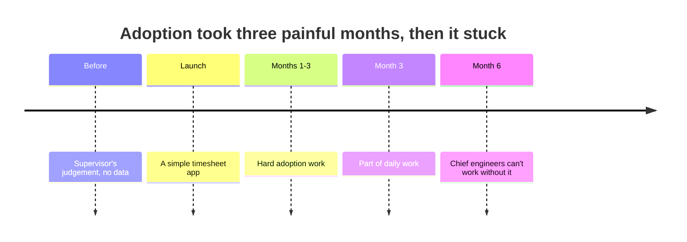
```mermaid
timeline
  title Adoption took three painful months, then it stuck
  Before : Supervisor's judgement, no data
  Launch : A simple timesheet app
  Months 1-3 : Hard adoption work
  Month 3 : Part of daily work
  Month 6 : Chief engineers can't work without it
```

The first three months were painful. [ADD: what that looked like, for example missed entries, pushback, or fixes to the app]

Around the third month, things changed. The app stopped being a new tool people were told to use and became part of how the organisation worked.

By the sixth month, the chief engineers couldn't work without it. The clearest sign came when one of them complained because someone else wasn't using the app properly. The people whose judgement the data was meant to support had become the people enforcing it.

### What I'd tell anyone starting a digital transformation

1. **Start with something simple and doable.** The first project isn't only about its own value. It earns the trust you need for every project after it.
2. **Treat adoption as the project.** Plan time, people, and attention for it. For us, that was three months of hard work after the app itself was ready.
3. **Remove every excuse.** Usability is what stops people from blaming the tool when they don't want to change.
4. **Show management value early.** If leaders can't see what they get, their support won't last long enough for adoption to happen.
5. **Watch for users who enforce it themselves.** The clearest sign of success isn't a launch date. It's the day a senior user complains when someone else doesn't use the system properly.

The technology in a digital transformation is usually the part you can plan most precisely. The people are the part that decides whether it works.

### To add before publishing

- [ ] Concrete usability choices (the two [ADD] notes above)
- [ ] What the app produced for management
- [ ] What made months 1 to 3 painful: resistance, bugs, missing data, or something else?
- [ ] What changed around month 3 to make it stick
- [ ] Any before/after result, for example how close progress estimates or proposals came to actual figures (only if shareable)
- [ ] Year, team size, and whether the app was built in-house
- [ ] Whether to name the company, or keep it as "an Indonesian EPC company"
- [ ] Which digital tools followed the timesheet app (a good link to future articles)

### Site metadata

```yaml
title: "Building the App Was Easy. Getting People to Use It Took Three Months."
lang: en
translationKey: timesheet-app-adoption
categories: [digital-transformation]
tags: [lessons-learned, change-management, adoption, construction]
series: digitalising-construction
seriesOrder: 1
summary: "Rolling out a timesheet app in a construction company: why adoption, not technology, was the hard part, and what made it stick."
published: null
updated: null
comments: true
map: false
draft: true
coverIllustration: true
```

---

## A2. The Dashboard Came Last: KPI Dashboards for a Construction Company's Leadership

*Part 2 of a series on digitalising a construction company. Part 1 covered how a simple timesheet app became part of daily work.*

Sooner or later, every leadership team asks for a dashboard. They want to see how the company is doing at a glance, and they want it to be right.

The trouble is that a dashboard can only show data that already exists, and in most traditional companies that data doesn't exist yet, or it lives in spreadsheets nobody fully trusts. Build the dashboard first and you get a polished screen with weak numbers behind it. Leaders notice quickly, and they stop looking.

At the EPC company where I led digitalisation, the dashboards for leadership came last. By the time we built them, the data was already flowing in every day, because people were using our app for their daily work.

### From a timesheet app to an enterprise app

The timesheet app didn't stay a timesheet app. Once it was part of daily work, we kept adding modules to the same app: leave requests, accounting, chat, an information broadcaster, and more. [ADD: other modules, and roughly when each was added]

Every module lived in one app with one database. Employees, projects, and time were recorded once and reused everywhere, instead of being typed again into separate systems.

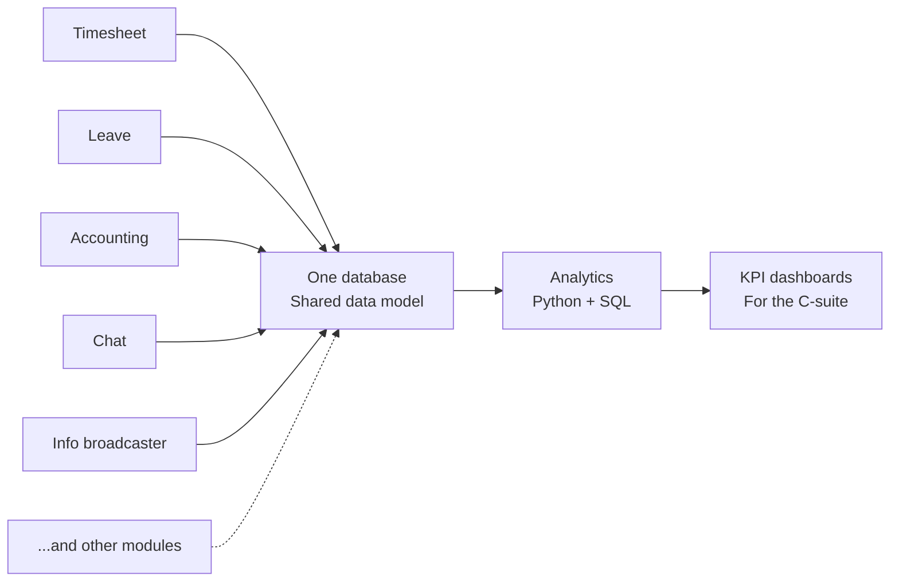
```mermaid
flowchart LR
  T["Timesheet"] --> DB["One database<br/>Shared data model"]
  L["Leave"] --> DB
  A["Accounting"] --> DB
  C["Chat"] --> DB
  B["Info broadcaster"] --> DB
  O["...and other modules"] -.-> DB
  DB --> AN["Analytics<br/>Python + SQL"]
  AN --> K["KPI dashboards<br/>For the C-suite"]
```

The dashboards for leadership sat at the end of this chain. They didn't need a separate data collection effort, because the data was already there.

### What the dashboards showed

Using Python and SQL on top of the app's database, we built analytics, KPI dashboards, and operational forecasts for the leadership team.

[CONFIRM: these are suggested KPIs based on the app's modules. Keep only the ones that were actually on the dashboards, and add any that are missing.]

The dashboards tracked KPIs such as these:

| KPI | Built from | The question it answers |
| --- | --- | --- |
| Actual vs planned man-hours | Timesheet, project plan | Is each project using more or less effort than planned? |
| Progress by recorded effort | Timesheet | How far along is each task, based on data rather than judgement? |
| Labour cost vs budget | Timesheet, accounting | Is labour spending on track for each project? |
| Utilisation rate | Timesheet, leave | How much of people's available time goes to project work? |
| Available capacity | Leave, timesheet | Who is free to take on work in the coming weeks? |
| Overtime hours | Timesheet | Where are teams overstretched? |
| Timesheet completion rate | Timesheet | Are people filling in the app on time, so the other numbers can be trusted? |
| Estimate accuracy | Timesheet, past proposals | How close were proposal estimates to the effort projects actually took? |

The value came from combining modules. Each module answers one question on its own; together they answer questions leadership actually cares about. For example, timesheet data shows how effort is spent, leave data shows who is available, and accounting data shows what it all costs. Combined, they can show progress, capacity, and cost side by side, all from the same source. [CONFIRM: which of these combinations you actually used]

This is also where Part 1 paid off. Progress had once been the chief supervisor's judgement call, and the same guesses fed into proposals. With months of timesheet data behind them, both progress reporting and proposal estimates could rest on actual recorded effort. [ADD: whether proposals or estimates measurably improved, if shareable]

### Working with leadership

I worked directly with the C-suite on what the dashboards should show. A dashboard for executives isn't a smaller version of an operational report. It needs to answer the questions they act on, and they need to trust where every number comes from.

Trust was easier to earn here than usual. The numbers weren't assembled from spreadsheets for the occasion; they came straight from the app staff used every day. When a figure looked surprising, we could trace it back to the entries behind it.

[ADD: how you worked with the C-suite, for example how you chose the KPIs, how often they reviewed the dashboards, and one moment when a dashboard changed a decision]

### What I'd tell anyone building executive dashboards

1. **Build the data habit before the dashboard.** A dashboard is only as good as the data people enter every day. Get an everyday tool adopted first, then build the view on top of it.
2. **Grow one platform instead of adding separate tools.** Each module we added lived in the same app and database, so every new feature made the data richer instead of creating another silo.
3. **Give people reasons to open the app daily.** Modules people need anyway, such as leave requests, keep the app part of the routine, and steady use keeps the data complete. [CONFIRM: whether chat and the information broadcaster played this role]
4. **Make every number traceable.** Executives trust a figure when they can see where it came from. Data from the daily work tool makes that possible.
5. **The dashboard is the last step, not the first.** If leadership asks for a dashboard on day one, the honest answer is often: first, let's make sure the data exists.

### To add before publishing

- [ ] Review the suggested KPIs: keep the real ones, remove the rest, and note which one leadership watched most
- [ ] Which module combinations were actually used (timesheet, leave, accounting, others)
- [ ] What the operational forecasts predicted
- [ ] How you worked with the C-suite, and one decision a dashboard changed
- [ ] Whether chat and the information broadcaster kept people using the app daily
- [ ] The order modules were added, and roughly over how long
- [ ] Any measurable result, for example better proposal accuracy (only if shareable)
- [ ] Dashboard tooling, if not built fully in Python (for example a BI tool)

### Site metadata

```yaml
title: "The Dashboard Came Last: KPI Dashboards for a Construction Company's Leadership"
lang: en
translationKey: kpi-dashboards-enterprise-app
categories: [digital-transformation]
tags: [kpi, dashboards, enterprise-app, lessons-learned, construction]
series: digitalising-construction
seriesOrder: 2
summary: "How a timesheet app grew into an enterprise app, and why the leadership dashboards built on it were trusted."
published: null
updated: null
comments: true
map: false
draft: true
coverIllustration: true
```

---

## A3. Data Governance Without the Bureaucracy: What to Govern, Why, and How

*A practical guide for organisations whose decisions increasingly depend on data, from enterprise apps to drone surveys and AI models.*

Every digital transformation eventually runs into the same wall. The app works, the dashboard looks good, the AI model runs, and then someone asks: *can we trust this number?* If nobody can answer with confidence, the whole investment loses credibility.

Data governance is how you make sure the answer is yes. It sounds bureaucratic, and done badly it is: thick policy documents, committees, and rules nobody follows. Done well, it's a small set of clear responsibilities and habits, mostly built into the tools people already use.

I've seen the need for it from several angles: an enterprise app whose data fed leadership dashboards, engineering programmes where many stakeholders handled the same data, and geospatial projects combining drone, satellite, sensor, and client data. The details differ, but the questions are the same.

### What data governance actually is

Strip away the jargon and data governance answers four questions for every important piece of data:

1. **Who is responsible for it?** One named owner, not "IT" or "everyone".
2. **What does it mean, and what counts as correct?** One agreed definition, and clear rules for quality.
3. **Who can see it, change it, or share it?** Access matched to need.
4. **Where did it come from, and where does it go?** A traceable path from source to report, and a plan for how long it's kept.

Everything else, including policies, roles, and tools, exists to answer those four questions consistently.

### What needs to be governed

You don't need to govern every byte. Focus on the data that drives decisions, money, or legal obligations. Within that, these are the areas that matter:

| Area | What it covers | Example from engineering and geospatial work |
| --- | --- | --- |
| Ownership | A named person accountable for each dataset | The project control lead owns man-hour data; the GIS lead owns the base maps |
| Definitions | One agreed meaning for key terms and codes | What "progress" means; one project code list used by every system |
| Quality | Completeness, accuracy, and timeliness, with checks | Timesheets filled in daily; survey accuracy checked against ground control points |
| Access and security | Who can view, edit, export, or delete | Salary data limited to HR and finance; client imagery limited to the project team |
| Lineage | Where each number came from and how it was transformed | A dashboard figure traceable to the entries behind it; a map traceable to the flight and processing run |
| Standards and metadata | Formats, naming, versions, and descriptive information | Coordinate reference system, capture date, and resolution recorded with every spatial layer |
| Sharing | Rules for giving data to clients, partners, or the public | What a consortium partner may receive; what needs client permission before publishing |
| Retention | How long data is kept, and how it is archived or deleted | Raw drone imagery archived after a set period; personal data deleted when no longer needed |
| Compliance | Legal and contractual obligations | Personal data rules, contract clauses, and rules on geospatial information |

In Indonesia, two laws are especially relevant. The Personal Data Protection Law (UU PDP, Law No. 27 of 2022) covers personal data such as employee records, and the Geospatial Information Law (Law No. 4 of 2011) covers geospatial data and mapping. I'd recommend checking the current implementing regulations with a legal adviser, since requirements and enforcement can change.

Geospatial data also needs extra attention: the same place can be described in different coordinate systems, and a layer without its capture date or accuracy is close to useless for decisions.

### Why it matters

Without governance, the costs show up in predictable ways:

- **Decisions on bad numbers.** A dashboard built on inconsistent definitions gives confident answers that are wrong.
- **Lost trust.** Once leaders catch one wrong figure, they start doubting all of them, and go back to gut feeling.
- **Arguments instead of action.** When two teams bring different numbers to a meeting, the meeting becomes about whose number is right.
- **Rework.** Data that has to be cleaned, reformatted, or re-collected for every new use wastes time on every project.
- **Disputes between stakeholders.** On programmes with many parties, unclear ownership and versions turn small differences into contract disputes.
- **Legal and reputational risk.** Leaked personal data or published client data can cost far more than any project earns.
- **AI that learns the wrong lessons.** A model trained on poorly governed data repeats its errors at scale.

[ADD: one real moment where missing governance caused a problem, or where good governance settled an argument]

### How to do it

The simplest way to think about governance is to follow data through its life and ask what could go wrong at each stage.

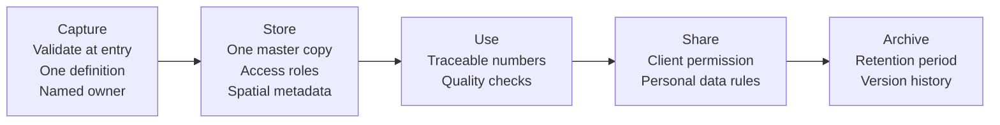
```mermaid
flowchart LR
  C["Capture<br/>Validate at entry<br/>One definition<br/>Named owner"] --> S["Store<br/>One master copy<br/>Access roles<br/>Spatial metadata"]
  S --> U["Use<br/>Traceable numbers<br/>Quality checks"]
  U --> SH["Share<br/>Client permission<br/>Personal data rules"]
  SH --> A["Archive<br/>Retention period<br/>Version history"]
```

*Across every stage: owners, standards, and regular reviews.*

In practice, these steps work well, roughly in this order:

1. **Start with decisions, not data.** List the decisions that matter most, then the data behind them. That's what you govern first.
2. **Name owners from the business, not IT.** The person who uses the data to make decisions should own its definition and quality. IT supports with systems.
3. **Agree definitions.** A short data dictionary of key terms and codes prevents most arguments before they start. One page is better than none.
4. **Build rules into the tools.** Required fields, drop-down lists instead of free text, validation, user roles, and audit logs enforce governance without anyone having to remember a policy.
5. **Keep one master copy.** Connect systems instead of copying data between them. Every copy is a future disagreement.
6. **Record lineage and metadata.** Note where data came from and what was done to it. For spatial data, always record the coordinate system, capture date, accuracy, and processing version.
7. **Set sharing and retention rules.** Decide in advance what goes to clients and partners, who approves it, and when data is archived or deleted.
8. **Measure quality and review regularly.** Track a few simple measures, such as completeness or timeliness, and review them with the owners on a fixed schedule.

[ADD: how you applied these on a multi-stakeholder engineering programme, and which step was hardest]

### Common mistakes

- **Writing the policy first.** A governance document nobody reads changes nothing. Start with rules built into tools, and write down what already works.
- **Making it IT's job.** IT can run the systems, but the people who create and use the data have to own it.
- **Governing everything at once.** Trying to cover every dataset on day one stalls the effort. Start with the data behind your most important decisions.
- **Rules without enforcement.** If the app lets people skip a required field, the rule doesn't exist.
- **Forgetting the people.** Governance changes habits, so it faces the same adoption challenge as any new system. Explain why, make it easy, and show the benefit.

### A starter checklist

If you're starting from nothing, these ten steps cover most of the value:

- [ ] List the 5 to 10 datasets behind your most important decisions
- [ ] Name one owner for each
- [ ] Write one-line definitions for the key terms and codes they use
- [ ] Add validation to the apps where that data is entered
- [ ] Set access roles: who can view, edit, export, and delete
- [ ] Keep one master copy and retire the duplicates
- [ ] Record source, capture date, and for spatial data the coordinate system and accuracy
- [ ] Agree what may be shared with clients and partners, and who approves it
- [ ] Set retention periods, especially for personal data
- [ ] Track a few data quality measures and review them regularly

### To add before publishing

- [ ] One real moment where missing governance caused a problem, or good governance settled an argument
- [ ] How you set up governance on a multi-stakeholder engineering programme: owners, standards, and what was hardest
- [ ] How client data was handled in your geospatial projects (permissions, sharing, retention), without naming clients
- [ ] Whether the enterprise app had specific governance features (roles, validation, audit trail)
- [ ] Legal check: confirm the current state of the Personal Data Protection Law and Geospatial Information Law requirements before publishing
- [ ] Decide whether this becomes Part 3 of the construction series or stands alone

### Site metadata

```yaml
title: "Data Governance Without the Bureaucracy: What to Govern, Why, and How"
lang: en
translationKey: data-governance-practical-guide
categories: [digital-transformation, geospatial-ai]
tags: [data-governance, data-quality, compliance, geospatial-data]
summary: "A practical guide to data governance: what needs governing, why it matters, and how to build it into everyday tools."
published: null
updated: null
comments: true
map: false
draft: true
coverIllustration: true
```

---

## A4. Spatial AI in Practice: What It Does Well, and Where It Fails

*Lessons from applying AI to drone, satellite, and sensor data across infrastructure, agriculture, energy, and environmental projects in Indonesia.*

"Spatial AI" sounds like a product you can buy. In practice, it's a way of working: using machine learning on data where location matters, such as aerial imagery, satellite scenes, LiDAR point clouds, and sensor readings tied to a place.

The promise is real. Spatial AI can count thousands of structures across a construction site, classify land cover across a region, or flag slopes likely to fail before anyone walks them. But after many projects, my main lesson is that the model is rarely the hard part. Getting the right data, the right ground truth, and the right people around the model is what decides whether it works.

This article walks through what spatial AI does well, where it struggles, and the rules I now follow on every project.

### Five things spatial AI does well

Most spatial AI work falls into five kinds of task. Each one below comes from a real project.

| Task | What it means | Example from my work |
| --- | --- | --- |
| Detect and count | Find specific objects in imagery and count them | Detecting every building on a new capital city site; counting pile caps, bored piles, and girders along a 142 km railway corridor |
| Classify | Label each area by what it is | Deep learning land cover classification feeding a landslide warning system; separating forest, farmland, and mining sites |
| Track change | Compare data over time to see what's new or gone | Building a dated history of what was built, when, and where on a construction site |
| Predict | Estimate something that can't be seen directly, or that hasn't happened yet | A Random Forest model forecasting landslide-prone areas daily; machine learning forecasting flood and erosion areas at hydropower sites; rice productivity estimated from drone and satellite data |
| Fuse | Combine many data sources into one picture | Drone, satellite, rain gauge, and SCADA data in one landslide early warning system |

Notice that "predict" covers very different things. Some predictions are about the present (how productive is this field?), others about the future (will this slope fail?). The second kind is much harder to validate.

### The model is the smallest part

It's tempting to think of spatial AI as "the model." In every project I've worked on, the model was one step of five, and rarely the one that decided success.

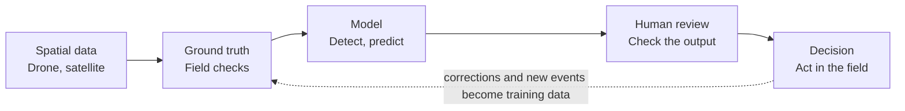
```mermaid
flowchart LR
  D["Spatial data<br/>Drone, satellite"] --> G["Ground truth<br/>Field checks"]
  G --> M["Model<br/>Detect, predict"]
  M --> H["Human review<br/>Check the output"]
  H --> X["Decision<br/>Act in the field"]
  X -.->|corrections and new events become training data| G
```

**Spatial data** has to be captured at the right time, resolution, and conditions. **Ground truth**, checked in the field, is what the model learns from and is tested against. **The model** does the detecting, classifying, or predicting. **Human review** catches what the model gets wrong. **The decision** is what someone actually does with the result.

The dashed line matters most. Every correction a reviewer makes, and every new event observed in the field, is fresh ground truth. Projects that close this loop keep getting better; projects that don't slowly drift out of date.

### What makes it hard, especially in Indonesia

**Clouds.** Tropical cloud cover hides the ground in much optical satellite imagery. Dry-season composites, radar, and drones flown under the cloud are often the only way to get consistent data.

**Local objects that global models don't know.** Models trained on generic datasets struggle with local features. On one construction site, small temporary workers' sheds (*bedeng*) were not reliably recognised, so we added manual checks. Local training data matters more than model architecture.

**Ground truth is scarce and expensive.** Every model needs examples checked in the field. Reaching remote sites takes time, money, and permits, so ground truth is usually the most limited resource on the project.

**One region isn't the whole country.** A model calibrated in one place may not transfer. In a national rice assessment, ground truth came from Java, but rain-fed fields elsewhere behave differently, so estimates far from the calibration areas carry more uncertainty.

**Rare events are hard to learn.** Landslides, floods, and similar hazards are infrequent at any single location, so there are few examples to train on. Balancing false alarms against missed warnings has to be tuned with the people who receive them.

**Tides and seasons move the target.** Coastlines shift with the tide and crops change with the season. Unless imagery dates and conditions are controlled, the model learns noise instead of change.

### Seven rules I follow now

1. **Start with the decision.** Ask what someone will do differently because of the output. On a construction site, the decision was whether a structure stood in a permitted area, and everything else was built around that.
2. **Budget for ground truth first.** Field data, labelling, and validation are where accuracy comes from. Plan them before choosing a model.
3. **Train on local examples.** A model that has never seen a bedeng won't find one. Collect and label examples from the place you're working.
4. **Keep a human in the loop.** Send uncertain results to people for review, and feed their corrections back into training.
5. **Choose models people can understand.** A Random Forest can show which inputs drove a landslide forecast, which helped operators trust it. Sometimes a simpler, explainable model is the better choice.
6. **Don't use AI where physics or statistics will do.** Our coastline forecast for Belitung Island relied on regression across six shorelines and a physical sea-level rule, not deep learning. Use AI where it adds something.
7. **Deliver in a form people use.** Video walkthroughs, a daily risk report, and dashboards got our results acted on. A model output nobody opens has no value.

Spatial AI is a powerful tool, but it's still a tool. The value comes from the decisions it improves, and that depends on everything around the model.

### To add before publishing

- [ ] One accuracy figure you can share, for example detection accuracy on structures or how often forecasts were right
- [ ] The models or libraries you used most (for example YOLO, U-Net, scikit-learn), if you're happy to name them
- [ ] A failure story beyond the bedeng example: a model that didn't work and what you changed
- [ ] Whether the Belitung example fits: confirm the forecast relied on regression and the Bruun Rule rather than AI
- [ ] Links to the related case studies once they're published

### Site metadata

```yaml
title: "Spatial AI in Practice: What It Does Well, and Where It Fails"
lang: en
translationKey: spatial-ai-in-practice
categories: [geospatial-ai, digital-transformation]
tags: [spatial-ai, machine-learning, remote-sensing, ground-truth, lessons-learned]
summary: "What spatial AI does well, why it struggles in tropical and local conditions, and seven rules for making it work."
published: null
updated: null
comments: true
map: false
draft: true
coverIllustration: true
```

---

## A5. Generative AI for a Small Geospatial Team: Faster Drafts, Same Responsibility

*How generative AI changed the way a small geospatial and digital transformation team works, and where it still can't be trusted on its own.*

In an earlier article I wrote about spatial AI: models that detect, classify, and predict from drone, satellite, and sensor data. Generative AI is different. It doesn't measure the world; it produces text, code, and images on request.

For a small team, that difference matters. Spatial AI improves the analysis. Generative AI speeds up everything around it: writing software, drafting reports, translating, and turning technical work into something others can read.

It has made us faster. It has also produced some confident mistakes. Both are worth sharing.

### Where it helped

| Use | What we did | What changed |
| --- | --- | --- |
| Prototyping software | Built a prototype wildfire early-warning system for a district in West Java with an AI coding assistant (Claude Code) | A working prototype in [ADD: time taken] instead of [ADD: usual estimate] |
| Building a website | Built this bilingual site, a static site with maps, search, and two languages, with the same assistant | A small team could build and maintain it without a dedicated web developer |
| Translation | First-draft English to Bahasa Indonesia translation of every article, checked against a technical glossary | Publishing in two languages became realistic |
| Presentations | Turned a technical coastline analysis into a slide summary with an AI notebook tool (NotebookLM) | Hours of slide-making reduced, with problems described below |
| Writing | Drafted case studies and articles from project notes, then corrected and filled in the details | Writing time went to the parts only we could write: facts, lessons, and judgement |

The common thread: generative AI is fastest at producing a first version. The value comes from what people do with that first version.

### Where it went wrong

**Maps that look right but aren't.** The AI-generated slides for our coastline study looked polished, but the coordinate labels on the maps were wrong, placing a near-equatorial island at latitudes around 40 to 55 degrees. Anyone with GIS training would spot it immediately, and it would undermine everything else on the slide. We now export maps from QGIS and never publish AI-drawn maps.

**Filling gaps with plausible guesses.** Asked to write about a project with incomplete notes, generative AI fills the gaps with things that sound right. In our own case study drafts, the useful habit was the opposite: mark unknowns as [TO CONFIRM] and let the person who did the work fill them in.

**Conflicting sources, smoothed over.** When source documents disagree, for example two versions of a forecast year, AI tends to pick one quietly. Those conflicts need to be surfaced, not hidden.

**Technical terms in translation.** Geospatial terms often have an established Indonesian usage, or none at all. Without a glossary, translations drift between versions.

**Confidential data.** Pasting client data, imagery, or internal figures into public AI tools can break contracts and trust. What goes into the tool matters as much as what comes out.

### Where to use it, and where not

Two questions decide whether generative AI is a good fit for a task: how easy is it to check the output, and how costly is an error if one slips through?

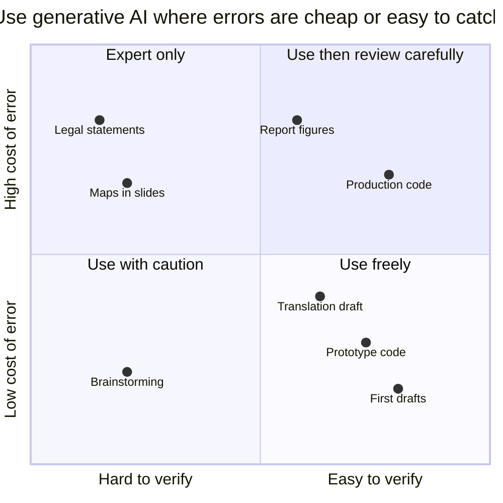
```mermaid
quadrantChart
  title Use generative AI where errors are cheap or easy to catch
  x-axis Hard to verify --> Easy to verify
  y-axis Low cost of error --> High cost of error
  quadrant-1 Use then review carefully
  quadrant-2 Expert only
  quadrant-3 Use with caution
  quadrant-4 Use freely
  Legal statements: [0.15, 0.82]
  Maps in slides: [0.21, 0.67]
  Report figures: [0.58, 0.82]
  Production code: [0.78, 0.69]
  Brainstorming: [0.21, 0.22]
  Translation draft: [0.63, 0.40]
  Prototype code: [0.73, 0.29]
  First drafts: [0.80, 0.18]
```

First drafts, prototype code, and translation drafts sit in the safe corner: mistakes are cheap and easy to spot. Production code and report figures matter more, so they need careful review. The dangerous corner is where errors are both costly and hard to spot. Our AI-generated maps landed there: the wrong coordinates looked plausible at a glance.

### Six rules we follow

1. **A person owns every fact.** AI can draft, but the person who did the work confirms every number, place, and claim before it goes out.
2. **Mark unknowns instead of filling them.** Ask the tool to flag what it doesn't know, and fill the gaps from real records.
3. **Never publish AI-drawn maps or figures.** Maps and charts come from GIS and analysis tools, where every coordinate and value can be traced.
4. **Keep client data out of public tools.** Use approved tools for confidential work, or remove anything identifying before using AI.
5. **Give it your standards.** A glossary for translation, a style guide for writing, and project conventions for code make output consistent from the first draft.
6. **Review code like a colleague's.** AI-written code still needs testing and review, especially before it touches client data or production systems.

Used this way, generative AI doesn't replace expertise. It removes the slow parts around it, so a small team can spend more of its time on fieldwork, analysis, and judgement.

### To add before publishing

- [ ] **Wildfire prototype:** confirm the details (district, what the prototype did, time taken compared with a usual estimate). This came from your CV, so check it is described accurately
- [ ] Whether you're comfortable naming the tools (Claude Code, NotebookLM), or prefer generic terms
- [ ] One more failure or surprise from your own use of generative AI
- [ ] Your team's actual policy on client data and AI tools, if one exists
- [ ] Links to the Spatial AI article and related case studies once published

### Site metadata

```yaml
title: "Generative AI for a Small Geospatial Team: Faster Drafts, Same Responsibility"
lang: en
translationKey: generative-ai-small-team
categories: [digital-transformation]
tags: [generative-ai, ai-assisted-development, translation, lessons-learned, perspectives]
summary: "Where generative AI sped up a small geospatial team, where it produced confident mistakes, and the rules that keep it useful."
published: null
updated: null
comments: true
map: false
draft: true
coverIllustration: true
```

---

## A6. Blockchain, Quantum, and AI: What People Ask For vs What They Actually Need

*Lessons from conversations with clients who asked for a technology before they knew their problem.*

In digital transformation work, one request comes up again and again: not "we have this problem," but "we want blockchain," or "we should be ready for quantum," or "we need AI." The technology arrives first; the problem is supposed to follow.

I understand why. These words appear in every conference keynote and annual report, and nobody wants to be left behind. But starting from the technology almost always leads to the wrong solution, or the right one at ten times the cost.

Here is what I've learned about three of the most requested technologies, and what people usually need instead.

### Blockchain: you usually want trust, not a blockchain

Many organisations ask for blockchain without being able to say why. In my experience, when you dig into the request, a simple database would usually do the job better, faster, and more cheaply.

[ADD: one anonymised example of a client who asked for blockchain, and what they actually needed]

What people really want when they say "blockchain" is usually *trust*: records nobody can quietly change, and a history everyone can check. Those are good goals, but a blockchain is only one way to reach them, and an expensive one. It earns its cost in a narrow situation: several parties who don't trust each other must write to the same record, and there's no single operator they would all accept to run it.

Researchers Karl Wüst and Arthur Gervais of ETH Zurich turned this into a decision flow in their 2018 paper *Do You Need a Blockchain?* A simplified version:

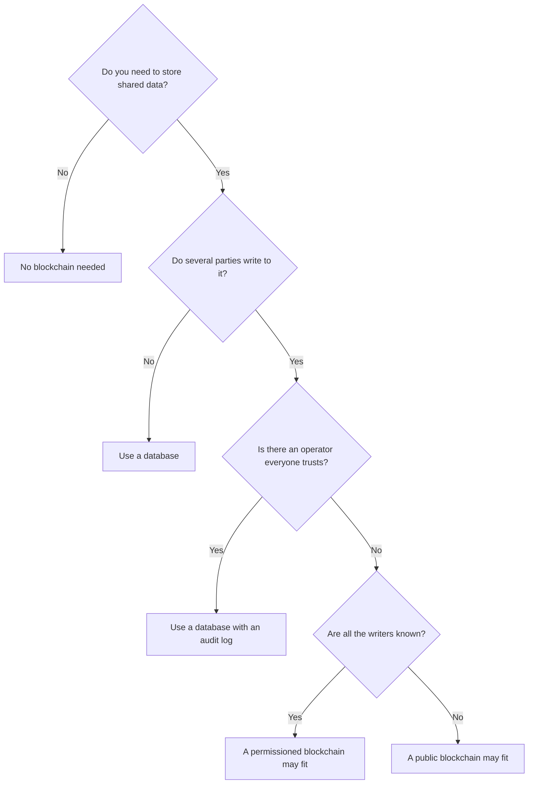
```mermaid
flowchart TD
  Q1{"Do you need to store shared data?"} -->|No| T1["No blockchain needed"]
  Q1 -->|Yes| Q2{"Do several parties write to it?"}
  Q2 -->|No| T2["Use a database"]
  Q2 -->|Yes| Q3{"Is there an operator everyone trusts?"}
  Q3 -->|Yes| T3["Use a database with an audit log"]
  Q3 -->|No| Q4{"Are all the writers known?"}
  Q4 -->|Yes| T4["A permissioned blockchain may fit"]
  Q4 -->|No| T5["A public blockchain may fit"]
```

In practice, most requests stop at the first or third question. If one organisation owns the data, or there's an operator everyone accepts, such as a ministry or an established agency, a well-governed database with access control and an audit log gives the same trust at a fraction of the cost. Some critics argue that even the permissioned outcome is rarely needed in practice.

There's one more catch. A blockchain guarantees that a record hasn't changed, not that it was right in the first place. If the data going in is wrong, a blockchain just preserves the error permanently. The hard problems are usually data quality and governance, which is why I'd start there.

### Quantum computing: a partner for classical computers, not a replacement

The most common misconception I hear is that quantum computers will replace today's computers, just faster. They won't. Quantum computers are not faster general-purpose machines. They are expected to excel at specific kinds of problems, mainly:

- **Simulating molecules and materials,** relevant to chemistry, drug discovery, and battery research.
- **Certain mathematical problems,** most famously factoring large numbers, which is why encryption is the main security concern.
- **Possibly some optimisation problems,** although how much quantum computers will help here is still debated.

For almost everything else, including databases, web applications, spreadsheets, and GIS processing, classical computers remain the right tool. Quantum computers also depend on classical computers to control them, prepare their inputs, and correct their errors. The realistic future is hybrid: classical systems do most of the work and hand specific sub-problems to quantum hardware. IBM's quantum leadership has said publicly that classical and quantum computing will coexist for the long term rather than replace each other.

Timelines are also longer than headlines suggest. As of 2026, a Forrester report on the state of quantum computing estimated that, even under optimistic scenarios, fully fault-tolerant quantum computers able to deliver transformational value are at least five years away.

**What to do now:** for most organisations, the practical quantum question isn't computing; it's security. Data encrypted today could be stored and decrypted later once powerful quantum computers exist, a risk often called "harvest now, decrypt later." Organisations holding data that must stay confidential for many years, such as personal records, land data, or sensitive infrastructure maps, should start planning a move to post-quantum cryptography. [VERIFY: current status of NIST post-quantum cryptography standards before publishing]

### AI: the model isn't the solution

With AI, the misconception is different. People believe in it, often rightly, but picture it as something you buy and switch on. In my experience, the model is the smallest part of an AI project. Ground truth from the field, local training data, human review, and a clear decision to support matter more.

I've written about this in detail in *Spatial AI in Practice*. The short version: ask what decision the AI will improve, check that the data to support it exists, and plan for people to review its output. If those three aren't in place, the best model in the world won't help.

### The common lesson: start from the problem

Blockchain, quantum computing, and AI are very different technologies, but the mistake is the same each time: choosing the tool before understanding the job. Good digital transformation runs the other way.

Before asking for any technology by name, it helps to answer five questions:

- [ ] **What problem are we solving, and for whom?** One sentence, without naming a technology.
- [ ] **What's the simplest thing that would work?** Often a database, a form, or a better process.
- [ ] **What has to be true for it to work?** Clean data, trusted owners, people willing to change habits.
- [ ] **What would this technology add that the simple option can't?** If there's no clear answer, the simple option wins.
- [ ] **How will we know it worked?** A measure agreed before starting.

The newest technology isn't always the right one. The right one is the one that solves the problem, gets used, and that the organisation can afford to run.

### To add before publishing

- [ ] **A real blockchain request,** anonymised: who asked, what they wanted it for, and what they actually needed
- [ ] **A real quantum conversation,** if you have one: who believed it would replace their computers, and how you explained it
- [ ] **Verify the post-quantum cryptography status** (NIST standards and any Indonesian guidance) as of the publishing date
- [ ] **Re-check the quantum timeline** before publishing; the field moves quickly, and the Forrester and IBM figures are as of 2026
- [ ] **Sources to link:** Wüst and Gervais, "Do You Need a Blockchain?" (2018); Forrester, *The State of Quantum Computing, 2026*; IBM's public quantum roadmap
- [ ] Link to the Spatial AI and data governance articles once published

### Site metadata

```yaml
title: "Blockchain, Quantum, and AI: What People Ask For vs What They Actually Need"
lang: en
translationKey: blockchain-quantum-ai-needs
categories: [digital-transformation]
tags: [perspectives, blockchain, quantum-computing, ai, emerging-technology]
summary: "Why 'we want blockchain' usually means 'we want trust', why quantum computers will complement rather than replace classical ones, and how to start from the problem instead of the technology."
published: null
updated: null
comments: true
map: false
draft: true
coverIllustration: true
```

---

## A7. One Map, Many Models: Where Geospatial AI in Indonesia Is Heading

*An opinion piece on where geospatial AI in Indonesia is going, and why the One Map Policy matters more than any algorithm.*

When people talk about the future of geospatial AI, they usually talk about models: better object detection, sharper satellites, faster processing. In Indonesia, I think the most important development isn't a model at all. It's a map.

The One Map Policy (*Kebijakan Satu Peta*) aims to give the country one geospatial reference, one standard, one database, and one geoportal. That sounds like bureaucracy. In practice, it changes what geospatial AI can do. An AI model can find a building, a mine, or a cleared forest. What it can't do on its own is say whether that thing *should* be there. For that, it needs an agreed map of boundaries, permits, and plans to compare against.

Across my projects, the most useful AI work has been exactly that comparison: structures checked against permitted areas, mining sites against licences, coastlines against their past. One Map is what turns that from a project-by-project effort into something the whole country can do.

What follows is my view, not a forecast with certainty. I'd welcome disagreement in the comments.

### Where One Map stands today

A few facts as of October 2026, from public sources:

| Milestone | Detail | Source |
| --- | --- | --- |
| Legal basis | Presidential Regulation No. 9 of 2016 accelerated the policy at a map accuracy of 1:50,000 | Perpres 9/2016 |
| Scope (2024) | Reported to involve 24 ministries and agencies, 34 provinces, and 158 thematic maps, with work underway on more detailed 1:5,000 base maps | Bisnis Indonesia, April 2024 |
| Early use | Thematic maps already used for agrarian reform, oil palm cover mapping, and the national anti-corruption strategy | Bisnis Indonesia, April 2024 |
| Single land map | Single map completed for Sulawesi; 2026 focused on the rest of Sumatra and Kalimantan | Minister of ATR/BPN, January 2026 |
| Target | Completion targeted before 2028, to help resolve agrarian conflicts | Minister of ATR/BPN, January 2026 |

Progress has been slower than first hoped, which is normal for a project that asks many institutions to agree on one version of the truth. But the direction is clear, and the deadline is close enough that practitioners should be preparing for what comes after.

### Five predictions

Here's how I expect the pieces to fit together: One Map as the agreed reference, observation data on top, and AI comparing the two.

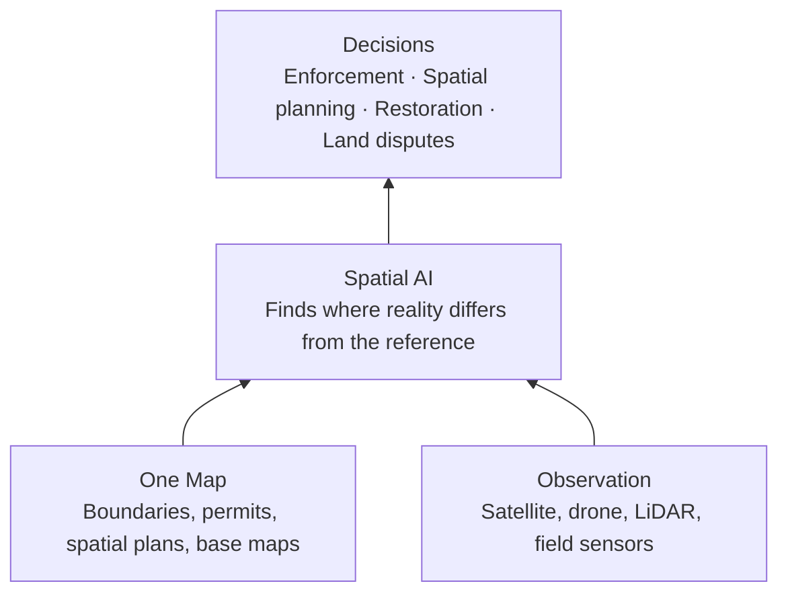
```mermaid
flowchart BT
  OM["One Map<br/>Boundaries, permits, spatial plans, base maps"] --> AI["Spatial AI<br/>Finds where reality differs from the reference"]
  OB["Observation<br/>Satellite, drone, LiDAR, field sensors"] --> AI
  AI --> D["Decisions<br/>Enforcement · Spatial planning · Restoration · Land disputes"]
```

#### 1. AI will shift from making maps to checking them

For years, much geospatial AI work in Indonesia has been about producing maps: land cover, building footprints, crop areas. Once an agreed reference exists, the higher-value task becomes comparison. Is this structure inside a permitted area? Is this mine inside a licence? Is this clearing inside a designated forest? On a new capital city site, our core deliverable was exactly that: every detected structure checked against where building was allowed. One Map makes that kind of check possible everywhere, not just where a client supplies the reference.

#### 2. Monitoring will replace one-off mapping

A map is a snapshot; most decisions need to know what changed and when. I expect more work to move towards continuous monitoring: detailed drone baselines a few times a year, with satellite and radar data in between. We used this pattern for a landslide early warning system, and it fits enforcement, agriculture, and coastal management equally well. For providers, that means services rather than projects.

#### 3. Detail will move from policy scale to parcel scale

The original One Map target was 1:50,000, good enough for national planning but not for deciding whether one building or one field is in the right place. The push toward 1:5,000 base maps raises the bar. Drones and LiDAR will fill in the detail, and AI will be needed simply to process the volume.

#### 4. Local data will be the real competitive advantage

Global AI models are trained mostly on other countries' landscapes. They struggle with Indonesian specifics: small temporary sheds on construction sites, smallholder plots, mixed agroforestry, persistent cloud. Whoever builds good Indonesian training data and ground truth will build better models than anyone importing a generic one. I'd like to see more of that data shared openly.

#### 5. Trust, not technology, will decide adoption

When AI results feed into agrarian conflicts, enforcement, or permits, they must stand up to scrutiny. That means traceable data, explainable methods, dated evidence, and human review. A detection from a model should be treated as a lead for investigation, not a verdict. Data governance will matter as much as model accuracy.

### What could slow it down

- **Coordination.** One map means many institutions agreeing on one version of boundaries and permits. That's a governance challenge before it's a technical one.
- **Keeping it current.** A single map is only valuable if it's updated. A reference that falls years behind reality will produce false alarms instead of insight.
- **Data access.** If the reference layers are hard to access for the companies and researchers building AI on top of them, adoption will stay inside government.
- **Skills.** Indonesia needs more people who combine GIS, AI, and domain knowledge in agriculture, mining, forestry, and infrastructure. Tools are easier to buy than this combination.
- **Clouds and terrain.** Tropical cloud cover and remote terrain don't go away. Radar, drones, and patient fieldwork stay essential.

### What practitioners can do now

1. **Align with the national standards.** Use the national reference system (SRGI2013) and record full metadata, so your data can be compared with One Map layers without rework.
2. **Learn change detection, not just classification.** The most valuable work will be finding where reality differs from the reference, and when it changed.
3. **Build local training data.** Label Indonesian examples, from small sheds to smallholder plots, and consider sharing what you can openly.
4. **Design for evidence.** Keep dates, sources, and processing steps for every output, so results can stand up in planning decisions and disputes.
5. **Think in services, not projects.** Clients will increasingly need ongoing monitoring rather than one-off maps. Plan your tools, pricing, and teams for that.

One Map won't do anything by itself. It's a foundation. The organisations and practitioners who learn to build on it, carefully and honestly, will shape how Indonesia uses geospatial AI for the next decade.

### To add before publishing

- [ ] **Re-check One Map status** on the publishing date; the facts table is as of October 2026, and the 2028 target may move
- [ ] **Link sources:** Perpres 9/2016; Bisnis Indonesia (April 2024) on scope and use; ATR/BPN statements (January 2026) on progress and the 2028 target
- [ ] **Verify the geoportal name and access** (for example Ina-Geoportal) before mentioning it
- [ ] Your own view on the boldest prediction: which one you'd stake your reputation on
- [ ] An example of One Map data you've used, or wished you could use, in a project
- [ ] Links to the IKN, illegal mining, and Belitung case studies once published

### Site metadata

```yaml
title: "One Map, Many Models: Where Geospatial AI in Indonesia Is Heading"
lang: en
translationKey: one-map-geospatial-ai-indonesia
categories: [geospatial-ai]
tags: [perspectives, indonesia, one-map-policy, spatial-ai, change-detection, governance]
summary: "Why the One Map Policy matters more than any algorithm, and five predictions for geospatial AI in Indonesia."
published: null
updated: null
comments: true
map: false
draft: true
coverIllustration: true
```
